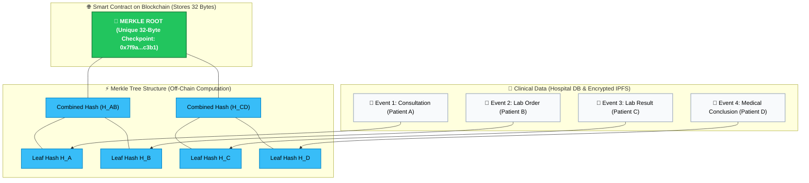
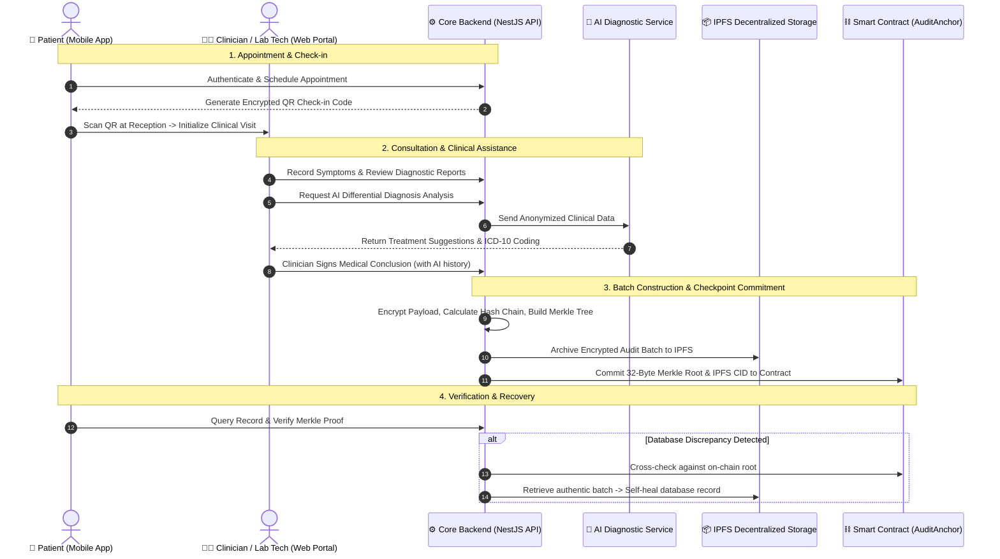

# Smart Hospital Management System with Biometric Authentication & Tamper-Evident Blockchain Audit Trail

[](apps/hospital-api)
[](apps/hospital-web)
[](apps/hospital-mobile)
[](apps/audit-contracts)
[](apps/hospital-api)
[-brightgreen)](apps/hospital-api)

> 🌐 **Language:** **[Tiếng Việt](README.md)** | **[English](README.en.md)**

---

## 🏥 1. What Is This Project & What Problem Does It Solve?

### ❓ Clinical Data Management Challenge:
In traditional hospital information systems:
- Medical records, diagnostic reports, and prescriptions are stored in centralized relational databases (e.g., PostgreSQL, MySQL).
- **Core Problem:** Centralized databases can be modified or deleted by privileged administrators, internal users, or compromised credentials without leaving verifiable cryptographic audit trails.
- During medical dispute resolution or external audits, third parties cannot independently verify the historical authenticity of a record without relying solely on internal database trust.

### 💡 Project Objectives:
This project delivers a **Hospital Information System (HIS)** integrating **Blockchain**, **IPFS**, and **Merkle Trees** to achieve:
1. **Cryptographic Audit Integrity:** Every clinical action (consultation, lab order, prescription, medical conclusion) is cryptographically hashed and anchored to a blockchain checkpoint.
2. **Discrepancy Detection & Data Recovery (Self-Healing):** If database records are altered off-chain, the system detects the discrepancy and facilitates recovery using the authentic archive preserved on IPFS.
3. **Clinical AI Assistance with Audit Tracking:** Provides diagnostic support based on clinical symptoms and lab findings, while logging full practitioner review history for accountability.

---

## ⚠️ 2. Technical Limitations of Direct On-Chain Storage

Storing full medical records directly on a blockchain ledger presents practical constraints:

| Limitation | Technical Context |
|---|---|
| 💸 **Storage Cost (Gas Fees)** | On-chain storage is priced per word of state. Large medical files (X-rays, MRI scans, unstructured clinical notes) incur significant overhead if stored directly on-chain. |
| 🔓 **Privacy & Data Protection (PII)** | Public blockchain ledgers are transparent and immutable. Direct on-chain storage of Personally Identifiable Information (PII) and health records conflicts with healthcare privacy regulations (HIPAA, GDPR). |
| ⏳ **Throughput & Block Latency** | Blockchain block generation intervals and block gas limits do not match the real-time transaction throughput required during daily hospital operations. |

---

## 💡 3. Proposed Solution: Merkle Tree & Hybrid Architecture

To address these constraints, the system implements a **Hybrid On-chain / Off-chain Architecture** using **Merkle Trees**.

### 🌳 Operational Overview:
1. Full clinical audit payloads are maintained in the local database and archived in encrypted form on IPFS.
2. Each record is converted into a 32-byte leaf hash within a sequential hash chain.
3. Leaf hashes are hierarchically paired and hashed into a binary tree, producing a single **32-byte Merkle Root** for the batch.
4. Only this **32-byte Merkle Root** is submitted to the on-chain smart contract as an immutable checkpoint.

---

### 🖼️ Merkle Tree Structure & Checkpoint Diagram



---

### 🔍 Verification Workflow (Merkle Proof)

To verify any individual record (e.g., Record B):
1. Compute the record's leaf hash: $H_B$.
2. Retrieve the compact Merkle Proof sibling hashes ($H_A$ and $H_{CD}$).
3. Compute the reconstructed root:
   $$H_B + H_A \xrightarrow{\text{SHA-256}} H_{AB}$$
   $$H_{AB} + H_{CD} \xrightarrow{\text{SHA-256}} \text{Merkle Root}$$
4. Compare against the **on-chain Merkle Root**:
   - If **Match**: The record is authentic and unaltered.
   - If **Mismatch**: The record has been modified after checkpoint commitment.

---

### 📊 Architecture Comparison Matrix

| Evaluation Criteria | Direct On-Chain Storage | Standard Database | Hybrid Model (Merkle + IPFS + Chain) |
|---|:---:|:---:|:---:|
| **Integrity & Immutability** | High | Subject to admin access | **High (Via on-chain Merkle Root)** |
| **Privacy Protection (PII)** | Low (Public ledger) | Internal only | **Preserved (Zero PII on-chain)** |
| **Storage Gas Cost** | High | Low | **Low (32 bytes per batch)** |
| **Operational Throughput** | Low (Block-dependent) | High | **High (Processed off-chain)** |
| **Audit & Recovery** | Manual | DB backup restore | **Automated audit and IPFS recovery** |

---

## 🛠️ 4. Clinical Workflow & Audit Lifecycle



---

## ⚡ 5. Empirical Benchmarks & Performance Evaluation

The architecture was evaluated on an isolated Hardhat EVM Cancun Node using **1,000 clinical audit records**:

> 📖 **Full technical report:** [docs/benchmarks/README.en.md](docs/benchmarks/README.en.md)

### 📊 Benchmark 1: Gas Consumption & Processing Latency (1,000 Logs)

| Metric | Raw On-Chain Baseline | Merkle Tree Hybrid (KLTN) | Improvement Factor |
|---|:---:|:---:|:---:|
| **On-Chain Transactions** | 1,000 txs | **1 tx** | 📉 **1,000x reduction (99.9%)** |
| **Total Gas Consumed** | 236,626,908 gas | **300,883 gas** | ⚡ **99.87% Gas Savings** |
| **Average Gas / Log** | 236,627 gas / log | **300.88 gas / log** | 💡 **786.4x More Cost-Effective** |
| **Local Processing Time** | 2,021 ms (~2.02s) | **22 ms** (~0.022s) | ⏱️ **91.9x Faster** |
| **Blockchain Confirmation** | 2 – 3.5 minutes *(8–10 blocks)* | **12 seconds** *(1 single block)* | 🎯 **Zero network congestion** |

<p align="center">
  
</p>

---

### 🛡️ Benchmark 2: Tamper Detection & Adversarial Attack Simulation

Four database tampering scenarios were evaluated: single-field modification, record deletion, event reordering, and fake record injection:

| Tamper Scenario | Raw On-Chain Baseline | Merkle Tree Hybrid (KLTN) | Comparison |
|---|:---:|:---:|:---:|
| **1. Single Field Tamper (#450)** | Detected *(307 ms, 451 RPC)* | **Detected (5.3 ms, 1 RPC)** | ⚡ Merkle is **57x faster** |
| **2. Log Deletion (#720)** | Detected *(453 ms, 721 RPC)* | **Detected (4.9 ms, 1 RPC)** | 🎯 Merkle is **92x faster** |
| **3. Reorder Attack (#300 ⇄ #301)** | Detected *(190 ms, 301 RPC)* | **Detected (4.9 ms, 1 RPC)** | ⚡ Merkle is **38x faster** |
| **4. Fake Log Injection (#151)** | Detected *(98 ms, 152 RPC)* | **Detected (4.7 ms, 1 RPC)** | 🎯 Merkle is **21x faster** |
| **Total RPC Requests Required** | 152 – 721 requests | **1 single request** | 📉 Up to **721x lower RPC load** |
| **Network Bandwidth Incurred** | 37 KB – 180 KB | **0.06 KB (32 bytes hash)** | 📉 **3,000x lower bandwidth overhead** |

<p align="center">
  
</p>

---

## 🏛️ 6. Monorepo Project Structure

```text
KLTN/
├── apps/
│   ├── hospital-api/              # Backend Core Server (NestJS 10, Prisma, PostgreSQL, Multi-AI Gateway)
│   ├── hospital-web/              # Clinician & Admin Web Portal (React + Vite, TailwindCSS)
│   ├── hospital-mobile/           # Patient Mobile App (Expo React Native, QR Check-in)
│   └── audit-contracts/           # Blockchain Smart Contracts (Solidity v0.8.20 + Hardhat)
│
├── infrastructure/                # Docker Compose configurations, Nginx Reverse Proxy, Deployment scripts
├── docs/                          # In-depth technical architecture and engineering documentation
└── README.md                      # Project root documentation
```

---

## 🚀 7. Quick Start Guide

### Prerequisites:
- Node.js $\ge 20.x$, Docker & Docker Compose, Git.

### Step 1: Start Local Blockchain & Deploy Smart Contracts
```bash
cd apps/audit-contracts
npm install
npm run node
# In a separate terminal window:
npm run deploy:local
```

### Step 2: Start Backend Core API
```bash
cd apps/hospital-api
npm install
cp .env.example .env
npx prisma generate
npx prisma db push
npm run start:dev
```
*API Endpoint:* `http://localhost:3001/api`

### Step 3: Start Clinician & Admin Web Portal
```bash
cd apps/hospital-web
npm install
cp .env.example .env
npm run dev
```
*Web Portal URL:* `http://localhost:5173`

### Step 4: Start Patient Mobile Application
```bash
cd apps/hospital-mobile
npm install
cp .env.example .env
npx expo start
```
*Scan the generated QR code using the **Expo Go** mobile app on iOS/Android.*

---

## 📖 8. Technical Documentation Index

- ⚡ **[Empirical Performance & Tamper Detection Benchmark Report](docs/benchmarks/README.en.md)**
- 🎮 **[Backend 16 Controllers & API Endpoints Reference](docs/applications/hospital-api/en/controllers.md)**
- 🎯 **[Backend 59 Clinical & Administrative Use Cases](docs/applications/hospital-api/en/use-cases.md)**
- 🏗️ **[Infrastructure Architecture (Audit Engine, Blockchain, Multi-AI)](docs/applications/hospital-api/en/infrastructure.md)**
- ⛓️ **[Smart Contracts Architecture & Deployment Guide](apps/audit-contracts/README.en.md)**
- 💻 **[Admin & Clinician Web Portal Guide](apps/hospital-web/README.en.md)**
- 📱 **[Patient Mobile Portal Guide](apps/hospital-mobile/README.en.md)**