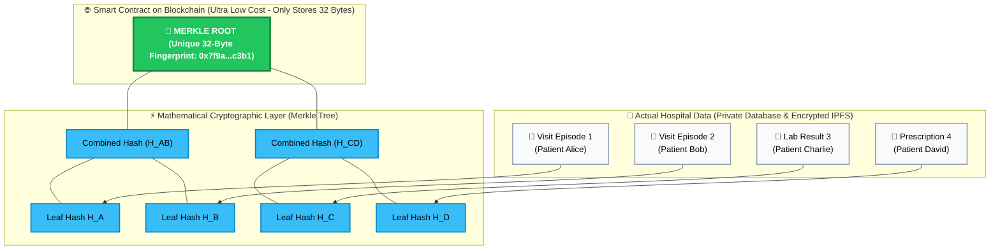
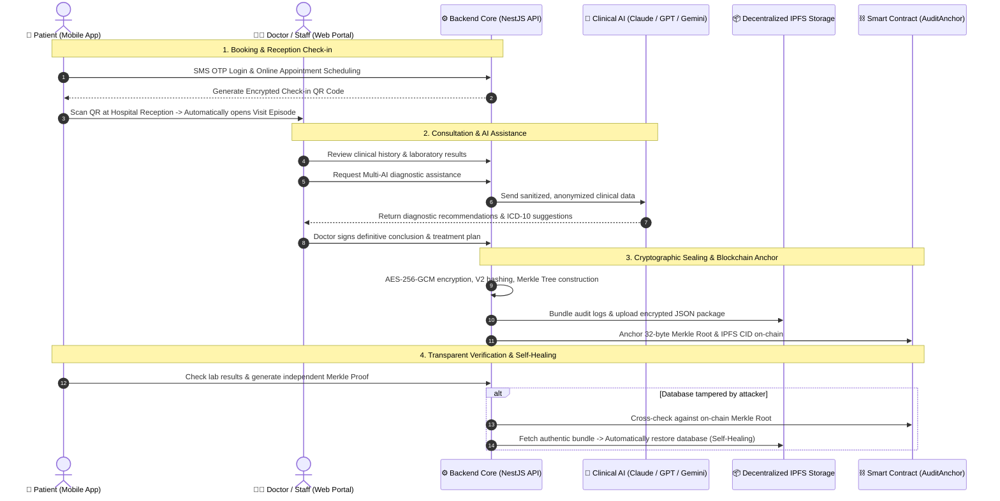

# Smart Hospital Management System with Biometric Authentication & Tamper-Evident Blockchain Audit Trail

[](apps/hospital-api)
[](apps/hospital-web)
[](apps/hospital-mobile)
[](apps/audit-contracts)
[](apps/hospital-api)
[-brightgreen)](apps/hospital-api)

> 🌐 **Language:** **[Tiếng Việt](README.md)** | **[English](README.en.md)**

---

## 🏥 1. What Is This Project & What Problem Does It Solve?

### ❓ The Real-World Healthcare Challenge:
Imagine an everyday hospital scenario:
- A patient visits a clinic, receives a consultation, and undergoes laboratory tests. All medical records are stored in a standard hospital database (e.g., PostgreSQL, MySQL).
- **The Critical Vulnerability:** Traditional databases can be silently altered or deleted by malicious insiders, compromised Database Administrators (DBAs), or external hackers. Records could be backdated, prescriptions swapped, or test results manipulated to commit insurance fraud or conceal medical malpractice.
- When legal disputes or insurance audits arise, courts **have no mathematical guarantee** that the displayed medical record has not been secretly tampered with.

### 💡 Project Mission & Breakthrough Objectives:
This project delivers a comprehensive **Smart Hospital Information System (HIS)** combining **Blockchain**, **IPFS**, and **Merkle Tree Cryptography** to solve three fundamental challenges:
1. **Absolute Tamper-Resistance (100% Immutability):** Every clinical action taken by doctors, nurses, and lab technicians is sealed with cryptographic proofs that cannot be repudiated or modified.
2. **Automated Self-Healing & Instant Recovery:** If an attacker modifies a lab result directly in the database, the system **instantly detects the discrepancy** and allows administrators to restore the authentic record from decentralized IPFS storage in one second.
3. **Multi-AI Clinical Assistant with Ethical Auditing:** Integrates Claude 3.5 Sonnet, GPT-4o, and Gemini 1.5 Pro to assist physicians with diagnostic suggestions while logging every doctor review decision (Accept / Reject / Modify) for ethical accountability.

---

## ⚠️ 2. Why Can't We Just Put Medical Records Directly On Blockchain?

A common misconception is: *"If we want records to be immutable, why not simply store all medical files directly on the blockchain?"* — **In practice, this is catastrophic** due to three fatal limitations:

| Blockchain Limitation | Why Medical Records CANNOT Be Stored Directly On-Chain |
|---|---|
| 💸 **Exorbitant Storage Costs (High Gas Fees)** | Storing 1MB of raw data on Ethereum can cost hundreds to thousands of dollars. Storing large medical imaging files (X-Rays, MRI, CT scans at 20MB–50MB each) would bankrupt the hospital. |
| 🔓 **Severe Patient Privacy Violations** | Blockchains are **public, permanent, and irrevocable ledgers**. Publishing patient names, citizen IDs, and confidential health conditions on-chain violates fundamental medical privacy laws (HIPAA, GDPR, National Health Data Regulations). |
| ⏳ **Slow Throughput & Scalability Bottlenecks** | Hospitals process thousands of clinical actions every hour. Blockchains process only dozens of transactions per second. Requiring on-chain confirmation for every single doctor click would completely paralyze hospital operations. |

---

## 💡 3. The Breakthrough Architecture: Merkle Trees & Hybrid Design

To overcome these three limitations, the system employs a **Hybrid On-chain / Off-chain Architecture** powered by the classic **Merkle Tree** data structure.

### 🌳 How Does a Merkle Tree Work? (Intuitive Explanation)
Instead of putting bulky medical records on the blockchain:
1. Each patient consultation or lab result is mathematically hashed into a unique compact string called a **Leaf Hash** (like taking a digital fingerprint of a document).
2. Adjacent digital fingerprints are combined in pairs and hashed together.
3. This pairing process repeats in a binary tree hierarchy until only **a single 32-byte hash remains, representing thousands of records**: the **Merkle Root**.
4. The hospital only transmits this **single 32-byte Merkle Root to the Blockchain Smart Contract**.

---

### 🖼️ Visual Diagram: How the Merkle Tree Operates



---

### 🔍 How to Verify a Single Record Without Trusting the Server (Merkle Proof)

If Patient Bob wants to prove his record was never tampered with:
1. The app computes Bob's leaf hash `H_B`.
2. The server provides just two companion pieces (called **Sibling Hashes**): neighbor hash `H_A` and subtree hash `H_CD`.
3. The app computes:
   $$\text{H\_B} + \text{H\_A} \xrightarrow{\text{SHA-256}} \text{H\_AB}$$
   $$\text{H\_AB} + \text{H\_CD} \xrightarrow{\text{SHA-256}} \text{Calculated Root}$$
4. The calculated root is compared against the **Merkle Root anchored on the Blockchain**:
   - If they **MATCH EXACTLY**: The record is 100% authentic and unaltered!
   - If they **MISMATCH**: Tampering in the database is instantly caught!

---

### 📊 Comparative Analysis: Traditional vs. Our Solution

| Feature | Direct On-Chain Storage | Traditional Database (MySQL) | **Our Solution (Merkle + Blockchain + IPFS)** |
|---|:---:|:---:|:---:|
| **Tamper Resistance** | ✅ Absolute | ❌ Easily altered by DBAs | ✅ **Absolute (Via On-Chain Merkle Root)** |
| **Patient Privacy** | ❌ Violated (Public data) | ⚠️ Depends on admins | ✅ **100% Private (Zero PII on-chain)** |
| **Storage & Gas Costs** | ❌ Prohibitive | ✅ Cheap | ✅ **Ultra Cheap (Only 32 bytes on-chain)** |
| **System Throughput** | ❌ Slow (Seconds per action) | ✅ Fast | ✅ **Instantaneous (Thousands of ops/sec)** |
| **Database Self-Healing** | ❌ None | ❌ Manual backup restore | ✅ **Instant automated self-healing from IPFS** |

---

## 🛠️ 4. Real-World Clinical & Auditing Workflow



---

## 🏛️ 5. Monorepo Project Structure

```text
KLTN/
├── apps/
│   ├── hospital-api/              # Core API Server (NestJS 10, Prisma, PostgreSQL, Multi-AI Gateway)
│   ├── hospital-web/              # Web Clinical & Admin Portal (React, Vite, Tailwind CSS)
│   ├── hospital-mobile/           # Mobile Patient App (Expo React Native, QR Check-in)
│   └── audit-contracts/           # Solidity Smart Contracts (Solidity v0.8.20 + Hardhat)
│
├── infrastructure/                # Docker Compose, Nginx Reverse Proxy, Deployment scripts
├── docs/                          # Detailed technical and architecture documentation
└── README.md                      # Primary project overview
```

---

## 🚀 6. Quick Start Guide

### Prerequisites:
- Node.js $\ge 20.x$, Docker & Docker Compose, Git.

### Step 1: Start Local Blockchain Node & Deploy Smart Contracts
```bash
cd apps/audit-contracts
npm install
npm run node
# In a separate terminal:
npm run deploy:local
```

### Step 2: Configure & Start Backend API
```bash
cd apps/hospital-api
npm install
cp .env.example .env
npx prisma generate
npx prisma db push
npm run start:dev
```
*API runs at:* `http://localhost:3001/api`

### Step 3: Start Web Clinical & Admin Portal
```bash
cd apps/hospital-web
npm install
cp .env.example .env
npm run dev
```
*Web Portal runs at:* `http://localhost:5173`

### Step 4: Start Mobile Patient App
```bash
cd apps/hospital-mobile
npm install
cp .env.example .env
npx expo start
```
*Scan the terminal QR code with the **Expo Go** mobile app.*

---

## 📖 7. Comprehensive Technical Documentation Links

- 🎮 **[Backend 16 Controllers & API Endpoints Specification](docs/applications/hospital-api/en/controllers.md)**
- 🎯 **[Backend 59 Business Use Cases Specification](docs/applications/hospital-api/en/use-cases.md)**
- 🏗️ **[Backend Technical Infrastructure (Audit Engine, Blockchain, Multi-AI)](docs/applications/hospital-api/en/infrastructure.md)**
- ⛓️ **[Smart Contracts Specification](apps/audit-contracts/README.en.md)**
- 💻 **[Frontend Web Portal Specification](apps/hospital-web/README.en.md)**
- 📱 **[Mobile Patient Portal Specification](apps/hospital-mobile/README.en.md)**