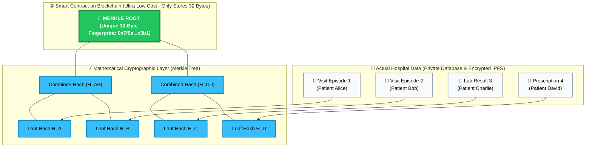
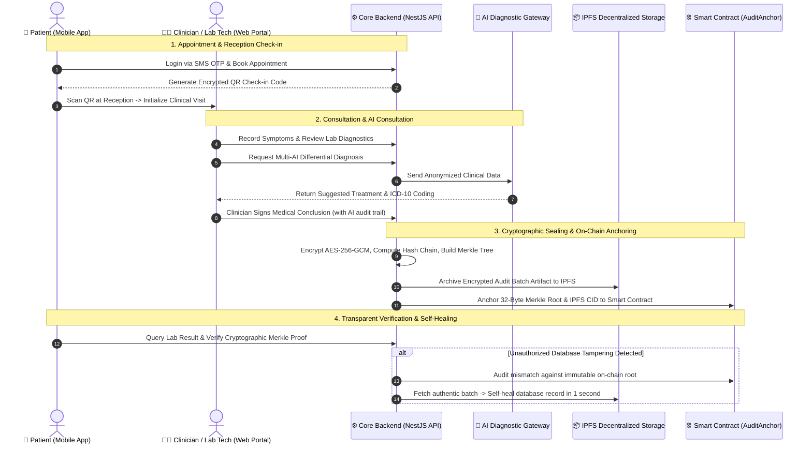

# Smart Hospital Management System with Biometric Authentication & Tamper-Evident Blockchain Audit Trail

[](apps/hospital-api)
[](apps/hospital-web)
[](apps/hospital-mobile)
[](apps/audit-contracts)
[](apps/hospital-api)
[-brightgreen)](apps/hospital-api)

> 🌐 **Language:** **[Tiếng Việt](README.md)** | **[English](README.en.md)**

---

## 🏥 1. What Is This Project & What Problem Does It Solve?

### ❓ The Real-World Healthcare Challenge:
Imagine an everyday hospital scenario:
- A patient visits a clinic, receives a consultation, and undergoes laboratory tests. All medical records are stored in a standard hospital database (e.g., PostgreSQL, MySQL).
- **The Critical Vulnerability:** Traditional databases can be silently altered or deleted by malicious insiders, compromised Database Administrators (DBAs), or external hackers. Records could be backdated, prescriptions swapped, or test results manipulated to commit insurance fraud or conceal medical malpractice.
- When legal disputes or insurance audits arise, courts **have no mathematical guarantee** that the displayed medical record has not been secretly tampered with.

### 💡 Project Mission & Breakthrough Objectives:
This project delivers a comprehensive **Smart Hospital Information System (HIS)** combining **Blockchain**, **IPFS**, and **Merkle Tree Cryptography** to solve three fundamental challenges:
1. **Absolute Tamper-Resistance (100% Immutability):** Every clinical action taken by doctors, nurses, and lab technicians is sealed with cryptographic proofs that cannot be repudiated or modified.
2. **Automated Self-Healing & Instant Recovery:** If an attacker modifies a lab result directly in the database, the system **instantly detects the discrepancy** and allows administrators to restore the authentic record from decentralized IPFS storage in one second.
3. **Multi-AI Clinical Assistant with Ethical Auditing:** Integrates Claude 3.5 Sonnet, GPT-4o, and Gemini 1.5 Pro to assist physicians with diagnostic suggestions while logging every doctor review decision (Accept / Reject / Modify) for ethical accountability.

---

## ⚠️ 2. Why Can't We Just Put Medical Records Directly On Blockchain?

A common misconception is: *"If we want records to be immutable, why not simply store all medical files directly on the blockchain?"* — **In practice, this is catastrophic** due to three fatal limitations:

| Blockchain Limitation | Why Medical Records CANNOT Be Stored Directly On-Chain |
|---|---|
| 💸 **Exorbitant Storage Costs (High Gas Fees)** | Storing 1MB of raw data on Ethereum can cost hundreds to thousands of dollars. Storing large medical imaging files (X-Rays, MRI, CT scans at 20MB–50MB each) would bankrupt the hospital. |
| 🔓 **Severe Patient Privacy Violations** | Blockchains are **public, permanent, and irrevocable ledgers**. Publishing patient names, citizen IDs, and confidential health conditions on-chain violates fundamental medical privacy laws (HIPAA, GDPR, National Health Data Regulations). |
| ⏳ **Slow Throughput & Scalability Bottlenecks** | Hospitals process thousands of clinical actions every hour. Blockchains process only dozens of transactions per second. Requiring on-chain confirmation for every single doctor click would completely paralyze hospital operations. |

---

## 💡 3. The Breakthrough Architecture: Merkle Trees & Hybrid Design

To overcome these three limitations, the system employs a **Hybrid On-chain / Off-chain Architecture** powered by the classic **Merkle Tree** data structure.

### 🌳 How Does a Merkle Tree Work? (Intuitive Explanation)
Instead of putting bulky medical records on the blockchain:
1. Each patient consultation or lab result is mathematically hashed into a unique compact string called a **Leaf Hash** (like taking a digital fingerprint of a document).
2. Adjacent digital fingerprints are combined in pairs and hashed together.
3. This pairing process repeats in a binary tree hierarchy until only **a single 32-byte hash remains, representing thousands of records**: the **Merkle Root**.
4. The hospital only transmits this **single 32-byte Merkle Root to the Blockchain Smart Contract**.

---

### 🖼️ Visual Diagram: How the Merkle Tree Operates



---

### 🔍 How to Verify a Single Record Without Trusting the Server (Merkle Proof)

Suppose Patient Bob wants to independently verify that his medical record was never tampered with:
1. The client app calculates Bob's leaf hash `H_B`.
2. The server supplies only 2 sibling hashes (`H_A` and `H_CD`).
3. The client reconstructs the root:
   $$H_B + H_A \xrightarrow{\text{SHA-256}} H_{AB}$$
   $$H_{AB} + H_{CD} \xrightarrow{\text{SHA-256}} \text{Merkle Root}$$
4. The client compares the result against the **immutable Merkle Root stored on-chain**:
   - If **MATCH (100%)**: Guarantees the medical record is authentic down to the exact punctuation mark.
   - If **MISMATCH**: Instantly flags unauthorized database tampering!

---

### 📊 Comparison Matrix: Architectural Paradigms

| Feature | Raw On-Chain Storage | Standard Database (MySQL) | **Our Hybrid Architecture (Merkle + IPFS + Chain)** |
|---|:---:|:---:|:---:|
| **Tamper Resistance** | ✅ Absolute | ❌ Vulnerable to DBAs/Hackers | ✅ **Absolute (Via On-Chain Merkle Root)** |
| **Patient Privacy** | ❌ Severe Violation (Public PII) | ⚠️ Depends on Admin | ✅ **100% Zero PII On-Chain** |
| **Gas Cost & Storage Fee** | ❌ Prohibitive ($ Millions/year) | ✅ Low | ✅ **Ultra Low (32 bytes per batch)** |
| **Transaction Latency** | ❌ Very Slow (Seconds/action) | ✅ Instant | ✅ **Instant (Thousands of ops/sec)** |
| **Self-Healing Recovery** | ❌ None | ❌ Manual DB Restores | ✅ **Instant Automated Recovery via IPFS** |

---

## 🛠️ 4. Clinical Workflow & Audit Lifecycle



---

## ⚡ 5. Empirical Benchmarks & Performance Evaluation

The hybrid architecture was benchmarked on an isolated Hardhat EVM Cancun Node over **1,000 realistic clinical audit logs** across two dimensions: (1) Gas Consumption & Scalability Latency, and (2) Adversarial Tamper Detection Capability.

> 📖 **Read the in-depth technical benchmark report:** [docs/benchmarks/README.en.md](docs/benchmarks/README.en.md)

### 📊 Benchmark 1: Gas Consumption & Processing Latency (1,000 Logs)

| Metric | Raw On-Chain Baseline | Merkle Tree Hybrid (KLTN) | Improvement Factor |
|---|:---:|:---:|:---:|
| **On-Chain Transactions** | 1,000 txs | **1 tx** | 📉 **1,000x reduction (99.9%)** |
| **Total Gas Consumed** | 236,626,908 gas | **300,883 gas** | ⚡ **99.87% Gas Savings** |
| **Average Gas / Log** | 236,627 gas / log | **300.88 gas / log** | 💡 **786.4x More Cost-Effective** |
| **Local Processing Time** | 2,021 ms (~2.02s) | **22 ms** (~0.022s) | ⏱️ **91.9x Faster** |
| **Blockchain Confirmation** | 2 – 3.5 minutes *(8–10 blocks)* | **12 seconds** *(1 single block)* | 🎯 **Instant, Zero Congestion Risk** |

<p align="center">
  
</p>

---

### 🛡️ Benchmark 2: Tamper Detection & Adversarial Attack Simulation

Four realistic database attack vectors were simulated: single field modification, unauthorized deletion, event reordering, and fraudulent record injection:

| Attack Vector / Tamper Scenario | Raw On-Chain Baseline | Merkle Tree Hybrid (KLTN) | Architectural Advantage |
|---|:---:|:---:|:---:|
| **1. Single Field Tamper (#450)** | Detected *(307 ms, 451 RPC)* | **Detected (5.3 ms, 1 RPC)** | ⚡ Merkle is **57x FASTER** |
| **2. Log Deletion (#720)** | Detected *(453 ms, 721 RPC)* | **Detected (4.9 ms, 1 RPC)** | 🎯 Merkle is **92x FASTER** |
| **3. Reorder Attack (#300 ⇄ #301)** | Detected *(190 ms, 301 RPC)* | **Detected (4.9 ms, 1 RPC)** | ⚡ Merkle is **38x FASTER** |
| **4. Fake Log Injection (#151)** | Detected *(98 ms, 152 RPC)* | **Detected (4.7 ms, 1 RPC)** | 🎯 Merkle is **21x FASTER** |
| **Total RPC Requests Required** | 152 – 721 requests | **1 single request** | 📉 **Up to 721x lower RPC load** |
| **Network Bandwidth Incurred** | 37 KB – 180 KB | **0.06 KB (32 bytes hash)** | 📉 **3,000x lower bandwidth overhead** |

<p align="center">
  
</p>

---

## 🏛️ 6. Monorepo Project Structure

```text
KLTN/
├── apps/
│   ├── hospital-api/              # Backend Core Server (NestJS 10, Prisma, PostgreSQL, Multi-AI Gateway)
│   ├── hospital-web/              # Clinician & Admin Web Portal (React + Vite, TailwindCSS)
│   ├── hospital-mobile/           # Patient Mobile App (Expo React Native, QR Check-in)
│   └── audit-contracts/           # Blockchain Smart Contracts (Solidity v0.8.20 + Hardhat)
│
├── infrastructure/                # Docker Compose configurations, Nginx Reverse Proxy, Deployment scripts
├── docs/                          # In-depth technical architecture and engineering documentation
└── README.md                      # Project root documentation
```

---

## 🚀 7. Quick Start Guide

### Prerequisites:
- Node.js $\ge 20.x$, Docker & Docker Compose, Git.

### Step 1: Start Local Blockchain & Deploy Smart Contracts
```bash
cd apps/audit-contracts
npm install
npm run node
# In a separate terminal window:
npm run deploy:local
```

### Step 2: Start Backend Core API
```bash
cd apps/hospital-api
npm install
cp .env.example .env
npx prisma generate
npx prisma db push
npm run start:dev
```
*API Endpoint:* `http://localhost:3001/api`

### Step 3: Start Clinician & Admin Web Portal
```bash
cd apps/hospital-web
npm install
cp .env.example .env
npm run dev
```
*Web Portal URL:* `http://localhost:5173`

### Step 4: Start Patient Mobile Application
```bash
cd apps/hospital-mobile
npm install
cp .env.example .env
npx expo start
```
*Scan the generated QR code using the **Expo Go** mobile app on iOS/Android.*

---

## 📖 8. Technical Documentation Index

- ⚡ **[Empirical Performance & Tamper Detection Benchmark Report](docs/benchmarks/README.en.md)**
- 🎮 **[Backend 16 Controllers & API Endpoints Reference](docs/applications/hospital-api/en/controllers.md)**
- 🎯 **[Backend 59 Clinical & Administrative Use Cases](docs/applications/hospital-api/en/use-cases.md)**
- 🏗️ **[Infrastructure Architecture (Audit Engine, Blockchain, Multi-AI)](docs/applications/hospital-api/en/infrastructure.md)**
- ⛓️ **[Smart Contracts Architecture & Deployment Guide](apps/audit-contracts/README.en.md)**
- 💻 **[Admin & Clinician Web Portal Guide](apps/hospital-web/README.en.md)**
- 📱 **[Patient Mobile Portal Guide](apps/hospital-mobile/README.en.md)**