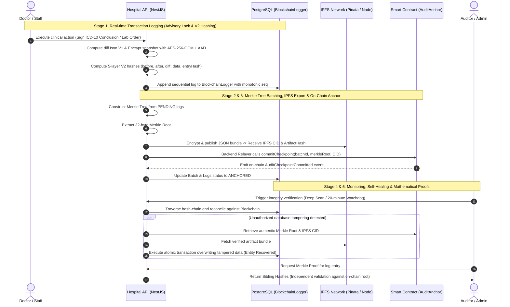

# Smart Hospital Management System with Biometric Authentication & Tamper-Evident Blockchain Audit Trail

[](apps/hospital-api)
[](apps/hospital-web)
[](apps/hospital-mobile)
[](apps/audit-contracts)
[](apps/hospital-api)
[-brightgreen)](apps/hospital-api)

> 🌐 **Language:** **[Tiếng Việt](README.md)** | **[English](README.en.md)**

---

## 🎯 1. Project Objectives & Thesis Context

In modern digital healthcare, ensuring the uncompromised integrity of clinical records and treatment histories is a critical necessity:
- **Real-world Challenges:** Electronic Health Records (EHR) risk being maliciously altered, deleted, or forged by compromised personnel, external attackers, or rouge database administrators for fraudulent insurance claims or medical malpractice concealment.
- **Privacy & Storage Constraints:** Medical records (PII, radiology imaging, laboratory results) **must never be stored directly on public blockchains** due to strict privacy regulations and prohibitive on-chain storage costs.

### 💡 The Proposed Breakthrough Solution
This thesis delivers a full-stack **Hospital Information System (HIS)** leveraging a **4-Tier Tamper-Evident Audit Architecture** combining **Blockchain**, **IPFS**, and **Modern Cryptography**:
1. **Real-time 5-Layer Off-Chain Hash-Chain (V2):** Every clinical mutation generates a 5-layer cryptographic hash (`beforeHash`, `afterHash`, `diffHash`, `dataHash`, `entryHash`) and encrypts sensitive snapshots with **AES-256-GCM authenticated encryption tied to AAD** (Authenticated Additional Data).
2. **On-Chain Merkle Tree Checkpointing:** Audit logs are periodically aggregated into batches, published as encrypted JSON bundles to **IPFS**, and anchored via their **32-byte Merkle Root** to the `AuditAnchor.sol` smart contract (Zero PII on-chain).
3. **Intelligent Self-Healing & Entity Recovery:** Features an automated 20-minute background Watchdog and Deep-Scan diagnostic tools that detect unauthorized local database modifications and automatically restore authentic records from verified IPFS artifacts.
4. **Multi-Factor Biometric & Web3 Security:** Supports 128-d biometric facial recognition (Cosine similarity $\le 0.45$), EIP-191 Web3 cryptographic wallet challenges for administrators, and mandatory **Face Step-Up MFA** for high-risk operations.
5. **Multi-AI Clinical Consultation Gateway:** Integrates Anthropic Claude 3.5 Sonnet, OpenAI GPT-4o, and Google Gemini 1.5 Pro with transparent ethical evaluation and clinical auditability.

---

## 🏛️ 2. Monorepo Architecture

```text
KLTN/
├── apps/
│   ├── hospital-api/              # Backend Core (NestJS 10, Prisma, PostgreSQL, Multi-AI Gateway)
│   ├── hospital-web/              # Web Clinical & Admin Portal (React, Vite, Tailwind CSS)
│   ├── hospital-mobile/           # Mobile Patient App (Expo React Native, QR Check-in)
│   └── audit-contracts/           # Smart Contracts (Solidity v0.8.20, Hardhat, Identity & Audit)
│
├── infrastructure/
│   ├── compose/                   # Docker Compose configurations (Dev, Prod, Test)
│   ├── nginx/                     # Nginx Reverse Proxy & SSL Gateway
│   └── scripts/                   # Shell scripts: Setup, Backup, Hardhat Deploy, Seed demo
│
├── docs/                          # Comprehensive technical and domain documentation
│   └── applications/
│       └── hospital-api/
│           ├── vi/                # Detailed Vietnamese documentation
│           └── en/                # Detailed English documentation (Controllers, UseCases, Infrastructure)
│
└── README.md                      # Primary repository documentation
```

---

## 🔄 3. End-to-End Audit Trail V2 Lifecycle

The complete audit trail lifecycle from real-time clinical mutation to on-chain checkpointing and self-healing is illustrated in 5 stages:



---

## 🔐 4. Web3 Access Control & Key Management

| Role | Storage Location | Responsibilities |
|---|---|---|
| **Owner / Root Governance** | `BLOCKCHAIN_OWNER_PRIVATE_KEY` (Cold Storage / Multisig in Production) | Add/revoke Admin and Relayer addresses; upgrade contracts. |
| **Relayer / Backend Writer** | `BLOCKCHAIN_RELAYER_PRIVATE_KEY` in Backend Secret Manager | Automatically signs operational transactions: anchors Merkle checkpoints, registers biometric hashes. |
| **Admin Wallet** | Personal Administrator Wallet (MetaMask / EIP-191) | Signs cryptographic authentication challenges for sensitive administrative operations. |

---

## 🚀 5. Quick Start Guide

### Step 1: Start Blockchain Node & Deploy Smart Contracts
```bash
cd apps/audit-contracts
npm install
npm run node
# In a new terminal:
npm run deploy:local
```

### Step 2: Configure & Start Backend API
```bash
cd apps/hospital-api
npm install
cp .env.example .env
npx prisma generate
npx prisma db push
npm run start:dev
```

### Step 3: Start Web Portal
```bash
cd apps/hospital-web
npm install
cp .env.example .env
npm run dev
```

### Step 4: Start Mobile Patient Portal
```bash
cd apps/hospital-mobile
npm install
cp .env.example .env
npx expo start
```

---

## 📖 6. Documentation Directory Links

- 🎮 **[Detailed Backend Controllers & Endpoints](docs/applications/hospital-api/en/controllers.md)**
- 🎯 **[Detailed Backend Business Use Cases](docs/applications/hospital-api/en/use-cases.md)**
- 🏗️ **[Detailed Backend Technical Infrastructure](docs/applications/hospital-api/en/infrastructure.md)**
- ⛓️ **[Smart Contracts Specification](apps/audit-contracts/README.en.md)**
- 💻 **[Frontend Web Portal Specification](apps/hospital-web/README.en.md)**
- 📱 **[Mobile Patient Portal Specification](apps/hospital-mobile/README.en.md)**