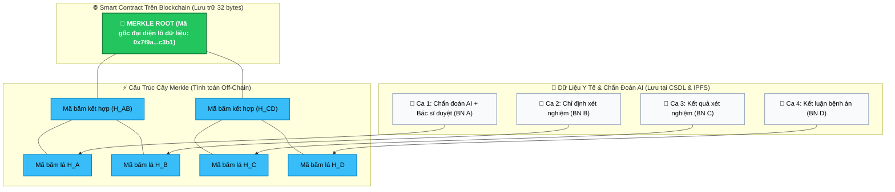
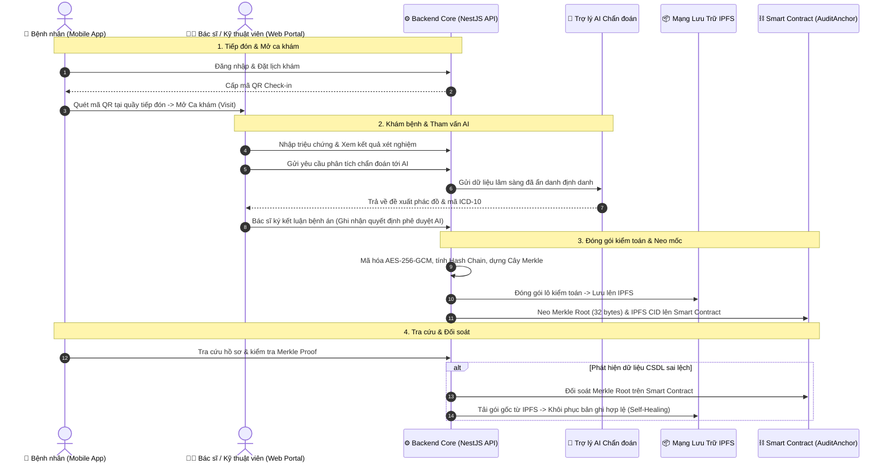

# Hệ Thống Lưu Trữ Kết Quả Chẩn Đoán AI Có Khả Năng Kiểm Chứng Bằng Blockchain

[](apps/hospital-api)
[](apps/hospital-web)
[](apps/hospital-mobile)
[](apps/audit-contracts)
[](apps/hospital-api)
[-brightgreen)](apps/hospital-api)

> 🌐 **Ngôn ngữ / Language:** **[Tiếng Việt](README.md)** | **[English](README.en.md)**

> 📌 **Ghi chú về phạm vi đề tài:**
> Trọng tâm nghiên cứu cốt lõi của đề tài là **lưu trữ và kiểm chứng tính toàn vẹn của các kết quả chẩn đoán y tế có sự tham vấn AI bằng công nghệ Blockchain**. Do luồng dữ liệu AI đơn lẻ có phạm vi hẹp, dự án đã mở rộng mô hình hóa thành một **hệ thống quản lý thông tin bệnh viện tinh gọn** (gồm đặt khám, tiếp đón QR, chỉ định xét nghiệm, kết luận lâm sàng) nhằm tạo môi trường dữ liệu đầu vào thực tế cho chu trình kiểm toán. Hệ thống đóng vai trò như một môi trường mô phỏng thực nghiệm phục vụ đề tài, không nhằm mục đích thay thế toàn bộ quy trình vận hành phức tạp của một bệnh viện thực tế.

---

## 🏥 1. Mục Tiêu Đề Tài & Bài Toán Giải Quyết

### ❓ Bài toán thực tế:
Khi áp dụng Trí tuệ nhân tạo (AI) vào hỗ trợ chẩn đoán y khoa:
- Các mô hình AI (như Claude, GPT, Gemini) đưa ra các gợi ý chẩn đoán và phác đồ điều trị. Bác sĩ là người xem xét, chỉnh sửa hoặc phê duyệt kết quả cuối cùng.
- **Vấn đề tồn tại:** Nếu kết quả chẩn đoán và quá trình tham vấn AI chỉ được lưu trữ trong cơ sở dữ liệu nội bộ thông thường, dữ liệu có thể bị chỉnh sửa hoặc xóa bỏ mà không để lại bằng chứng toán học độc lập. Khi xảy ra sự cố y khoa hoặc tranh chấp chuyên môn, rất khó xác minh lại bác sĩ đã nhận gợi ý gì từ AI và đã chỉnh sửa những gì tại thời điểm đưa ra kết luận.
- **Yêu cầu đặt ra:** Cần một cơ chế lưu trữ có khả năng **chống chối bỏ, kiểm chứng được tính nguyên bản** của cả kết quả chẩn đoán lẫn lịch sử tham vấn AI, đồng thời đảm bảo bảo mật thông tin riêng tư của người bệnh.

### 💡 Giải pháp của đề tài:
Dự án xây dựng một giải pháp kết hợp **Blockchain**, **IPFS** và **Cây Merkle (Merkle Tree)** để:
1. **Lưu trữ kiểm chứng kết quả chẩn đoán & AI:** Toàn bộ dữ liệu lâm sàng, kết quả gợi ý của AI và quyết định ký duyệt của bác sĩ được tạo chuỗi băm mật mã học (Hash Chain) và neo mốc (Checkpoint) lên Blockchain.
2. **Kiểm tra tính toàn vẹn độc lập (Merkle Proof):** Bất kỳ bên thứ ba nào (bệnh nhân, hội đồng chuyên môn, cơ quan bảo hiểm) đều có thể đối soát dữ liệu với mốc trên chuỗi khối mà không cần truy cập trực tiếp vào CSDL nội bộ.
3. **Phát hiện sai lệch & phục hồi dữ liệu (Self-Healing):** Nếu dữ liệu trong cơ sở dữ liệu bị chỉnh sửa ngoài ý muốn, hệ thống phát hiện vị trí sai lệch và hỗ trợ phục hồi lại từ kho lưu trữ IPFS.

---

## ⚠️ 2. Hạn Chế Khi Lưu Trữ Trực Tiếp Dữ Liệu Y Tế Lên Blockchain

Việc lưu trữ toàn bộ hồ sơ chẩn đoán trực tiếp lên chuỗi khối (On-Chain) gặp các hạn chế kỹ thuật:

| Hạn chế của Blockchain | Phân tích kỹ thuật |
|---|---|
| 💸 **Chi phí lưu trữ (Gas fee)** | Chi phí lưu trữ dữ liệu trạng thái trên Blockchain tăng theo dung lượng. Các tệp dữ liệu y tế, ảnh xét nghiệm và nội dung prompt AI chi tiết có dung lượng lớn, tạo chi phí gas cao nếu lưu trữ trực tiếp. |
| 🔓 **Quy định quyền riêng tư (Privacy & PII)** | Dữ liệu trên Blockchain có tính công khai và không thể xóa bỏ. Lưu trữ trực tiếp thông tin định danh cá nhân (PII) của bệnh nhân sẽ vi phạm các quy định bảo vệ dữ liệu y tế (HIPAA, GDPR). |
| ⏳ **Băng thông và độ trễ giao dịch** | Tốc độ xử lý khối của Blockchain không phù hợp để ghi nhận từng lượt thao tác nghiệp vụ tức thời. |

---

## 💡 3. Giải Pháp Áp Dụng: Cây Merkle (Merkle Tree) & Mô Hình Lai (Hybrid Architecture)

Để giải quyết các hạn chế trên, hệ thống sử dụng **Mô hình kiến trúc lai (Hybrid On-chain / Off-chain)** kết hợp **Cây Merkle**.

### 🌳 Nguyên lý hoạt động:
1. Dữ liệu chi tiết của từng ca chẩn đoán (kèm log AI) được lưu trữ tại cơ sở dữ liệu nội bộ và đóng gói mã hóa lên IPFS.
2. Mỗi bản ghi được băm thành một mã băm lá (Leaf Hash) 32 bytes theo chuỗi tuần tự (Hash Chain).
3. Các mã băm lá được ghép cặp và băm phân cấp thành Cây Merkle để tạo ra một **Merkle Root (32 bytes)** đại diện cho toàn bộ lô dữ liệu.
4. Hệ thống chỉ gửi duy nhất **mã Merkle Root 32 bytes** lên Smart Contract trên Blockchain để làm mốc đối soát.

---

### 🖼️ Sơ Đồ Cấu Trúc Cây Merkle & Mốc Neo Dữ Liệu



---

### 🔍 Quy trình xác thực tính toàn vẹn (Merkle Proof)

Khi cần xác minh một bản ghi chẩn đoán bất kỳ (ví dụ: Bản ghi B):
1. Hệ thống tính mã băm của bản ghi: $H_B$.
2. Sử dụng đường dẫn chứng thực Merkle Proof gồm các mã băm liền kề ($H_A$ và $H_{CD}$).
3. Tính toán lại mã gốc:
   $$H_B + H_A \xrightarrow{\text{SHA-256}} H_{AB}$$
   $$H_{AB} + H_{CD} \xrightarrow{\text{SHA-256}} \text{Merkle Root}$$
4. So khớp kết quả với **Merkle Root đã lưu trên Blockchain**:
   - Nếu **Trùng khớp**: Dữ liệu chẩn đoán và quyết định của bác sĩ được xác thực nguyên bản, không bị can thiệp.
   - Nếu **Sai lệch**: Bản ghi đã bị chỉnh sửa so với thời điểm neo mốc.

---

### 📊 Bảng So Sánh Các Mô Hình Tiếp Cận

| Tiêu chí | Ghi trực tiếp On-Chain | CSDL truyền thống | Mô hình Lai (Merkle + IPFS + Chuỗi) |
|---|:---:|:---:|:---:|
| **Tính toàn vẹn & Chống sửa đổi** | Cao | Phụ thuộc quyền admin | **Cao (Nhờ Merkle Root on-chain)** |
| **Bảo vệ dữ liệu riêng tư (PII)** | Thấp (Dữ liệu công khai) | Nội bộ | **Đảm bảo (Zero PII on-chain)** |
| **Chi phí Gas lưu trữ** | Cao | Thấp | **Tối ưu (32 bytes mỗi lô)** |
| **Hiệu năng xử lý nghiệp vụ** | Chậm (Phụ thuộc block time) | Nhanh | **Nhanh (Xử lý tức thì tại backend)** |
| **Khả năng đối soát & Phục hồi** | Thủ công | Phục hồi từ backup CSDL | **Tự động đối soát và khôi phục từ IPFS** |

---

## 🛠️ 4. Quy Trình Nghiệp Vụ & Chu Kỳ Kiểm Toán



---

## ⚡ 5. Thực Nghiệm & Đánh Giá Hiệu Năng (Empirical Benchmarks)

Đo kiểm thực nghiệm được thực hiện trên môi trường Hardhat EVM Cancun Node với **1.000 bản ghi nhật ký y tế**:

> 📖 **Xem báo cáo kỹ thuật chi tiết:** [docs/benchmarks/README.md](docs/benchmarks/README.md)

### 📊 Benchmark 1: So sánh Tiêu thụ Gas & Thời gian xử lý (1.000 Logs)

| Chỉ Số Đo Lường | Ghi Raw On-Chain | Cây Merkle (KLTN) | Mức Độ Cải Thiện |
|---|:---:|:---:|:---:|
| **Số lượng giao dịch (Transactions)** | 1.000 transactions | **1 transaction** | 📉 **Giảm 1.000 lần (99,9%)** |
| **Tổng lượng Gas tiêu thụ** | 236.626.908 gas | **300.883 gas** | ⚡ **Tiết kiệm 99,87% Gas** |
| **Chi phí Gas / 1 log** | 236.627 gas / log | **300,88 gas / log** | 💡 **Tối ưu hơn 786,4 lần** |
| **Thời gian xử lý local** | 2.021 ms (~2,02s) | **22 ms** (~0,022s) | ⏱️ **Nhanh hơn 91,9 lần** |
| **Thời gian xác nhận On-Chain** | 2 – 3,5 phút *(8–10 khối)* | **12 giây** *(1 khối duy nhất)* | 🎯 **Không phát sinh nghẽn mạng** |

<p align="center">
  
</p>

---

### 🛡️ Benchmark 2: Khả Năng Phát Hiện Sai Sót Dữ Liệu (Tamper Detection)

Thực nghiệm 4 kịch bản can thiệp dữ liệu: sửa 1 trường dữ liệu, xóa bản ghi, tráo đổi thứ tự và chèn bản ghi mới:

| Kịch Bản Can Thiệp / Sai Lệch | Ghi Raw On-Chain | Cây Merkle (KLTN) | So Sánh Hiệu Quả |
|---|:---:|:---:|:---:|
| **1. Sửa 1 trường dữ liệu (#450)** | Phát hiện *(307 ms, 451 RPC)* | **Phát hiện (5,3 ms, 1 RPC)** | ⚡ Merkle nhanh hơn **57 lần** |
| **2. Xóa bản ghi kiểm toán (#720)** | Phát hiện *(453 ms, 721 RPC)* | **Phát hiện (4,9 ms, 1 RPC)** | 🎯 Merkle nhanh hơn **92 lần** |
| **3. Tráo đổi thứ tự (#300 ⇄ #301)** | Phát hiện *(190 ms, 301 RPC)* | **Phát hiện (4,9 ms, 1 RPC)** | ⚡ Merkle nhanh hơn **38 lần** |
| **4. Chèn bản ghi giả mạo (#151)** | Phát hiện *(98 ms, 152 RPC)* | **Phát hiện (4,7 ms, 1 RPC)** | 🎯 Merkle nhanh hơn **21 lần** |
| **Số lượng RPC Request cần gọi** | 152 – 721 requests | **1 request duy nhất** | 📉 Giảm tới **721 lần** số request RPC |
| **Băng thông tải về (Bandwidth)** | 37 KB – 180 KB | **0,06 KB (32 bytes hash)** | 📉 Tiết kiệm tới **3.000 lần** băng thông |

<p align="center">
  
</p>

---

## 🏛️ 6. Cấu Trúc Toàn Bộ Dự Án (Monorepo)

```text
KLTN/
├── apps/
│   ├── hospital-api/              # Máy chủ Backend (NestJS 10, Prisma, PostgreSQL, Multi-AI Gateway)
│   ├── hospital-web/              # Giao diện Web Bác sĩ, Quản trị viên & Kỹ thuật viên (React + Vite)
│   ├── hospital-mobile/           # Ứng dụng Bệnh nhân Di động (Expo React Native, QR Check-in)
│   └── audit-contracts/           # Bộ Hợp đồng thông minh Smart Contracts (Solidity v0.8.20 + Hardhat)
│
├── infrastructure/                # Cấu hình Docker Compose, Nginx Reverse Proxy, Script triển khai
├── docs/                          # Kho tài liệu kỹ thuật & kiến trúc chuyên sâu
└── README.md                      # Tài liệu tổng quan dự án
```

---

## 🚀 7. Hướng Dẫn Cài Đặt & Khởi Chạy Nhanh (Quick Start)

### Yêu cầu môi trường:
- Node.js $\ge 20.x$, Docker & Docker Compose, Git.

### Bước 1: Khởi động Blockchain Local & Deploy Smart Contracts
```bash
cd apps/audit-contracts
npm install
npm run node
# Mở một cửa sổ terminal khác:
npm run deploy:local
```

### Bước 2: Khởi chạy Backend API
```bash
cd apps/hospital-api
npm install
cp .env.example .env
npx prisma generate
npx prisma db push
npm run start:dev
```
*API sẽ chạy tại:* `http://localhost:3001/api`

### Bước 3: Khởi chạy Giao diện Web Quản trị & Bác sĩ
```bash
cd apps/hospital-web
npm install
cp .env.example .env
npm run dev
```
*Web Portal sẽ chạy tại:* `http://localhost:5173`

### Bước 4: Khởi chạy Ứng dụng Mobile Bệnh nhân
```bash
cd apps/hospital-mobile
npm install
cp .env.example .env
npx expo start
```
*Dùng ứng dụng **Expo Go** trên điện thoại để quét mã QR và trải nghiệm.*

---

## 📖 8. Danh Mục Tài Liệu Kỹ Thuật Chuyên Sâu

- ⚡ **[Báo Cáo Benchmark Hiệu Năng & Khả Năng Phát Hiện Sai Sót](docs/benchmarks/README.md)**
- 🎮 **[Tài Liệu Chi Tiết 16 Controllers Backend & Endpoints](docs/applications/hospital-api/vi/controllers.md)**
- 🎯 **[Tài Liệu Chi Tiết 59 Use Cases Nghiệp Vụ Backend](docs/applications/hospital-api/vi/use-cases.md)**
- 🏗️ **[Tài Liệu Cấu Trúc Hạ Tầng (Audit Engine, Blockchain, Multi-AI)](docs/applications/hospital-api/vi/infrastructure.md)**
- ⛓️ **[Hướng Dẫn Hợp Đồng Thông Minh Smart Contracts](apps/audit-contracts/README.md)**
- 💻 **[Hướng Dẫn Giao Diện Web Quản Trị](apps/hospital-web/README.md)**
- 📱 **[Hướng Dẫn Cổng Bệnh Nhân Mobile](apps/hospital-mobile/README.md)**