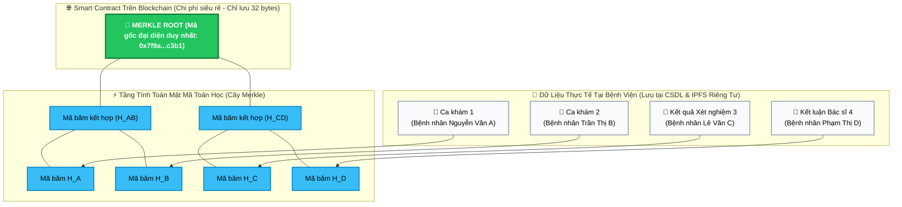

# Hệ Thống Quản Lý Bệnh Viện Thông Minh Tích Hợp Bảo Mật Sinh Trắc Học & Chuỗi Nhật Ký Kiểm Toán Chống Can Thiệp

[](apps/hospital-api)
[](apps/hospital-web)
[](apps/hospital-mobile)
[](apps/audit-contracts)
[](apps/hospital-api)
[-brightgreen)](apps/hospital-api)

> 🌐 **Ngôn ngữ / Language:** **[Tiếng Việt](README.md)** | **[English](README.en.md)**

---

## 🏥 1. Dự Án Này Để Làm Gì & Giải Quyết Vấn Đề Gì?

### ❓ Bài toán thực tế trong ngành y tế:
Hãy tưởng tượng một tình huống thực tế tại bệnh viện:
- Một bệnh nhân đi khám, được bác sĩ chẩn đoán và chỉ định điều trị. Toàn bộ hồ sơ được lưu vào máy tính bệnh viện (Cơ sở dữ liệu truyền thống như MySQL, PostgreSQL).
- **Vấn đề nguy hiểm:** Cơ sở dữ liệu truyền thống hoàn toàn có thể bị chỉnh sửa bởi một quản trị viên (DBA) thoái hóa biến chất, một nhân viên y tế muốn che giấu sai sót chuyên môn, hoặc một hacker tấn công vào máy chủ. Họ có thể sửa ngày giờ, đổi loại thuốc đã kê, sửa kết quả xét nghiệm nhằm trục lợi bảo hiểm hoặc trốn tránh trách nhiệm pháp lý.
- Khi xảy ra tranh chấp, tòa án hoặc cơ quan bảo hiểm y tế **không có cách nào chắc chắn 100%** rằng bệnh án đang xem có phải là bản gốc ban đầu hay đã bị chỉnh sửa lén trong cơ sở dữ liệu.

### 💡 Mục tiêu của dự án này:
Dự án xây dựng một **Hệ Thống Quản Lý Bệnh Viện Thông Minh Toàn Diện (Hospital Information System - HIS)** kết hợp công nghệ **Blockchain**, **IPFS** và **Mật mã học (Cây Merkle)** nhằm giải quyết 3 bài toán lớn:
1. **Chống sửa đổi / xóa lén bệnh án (Bất biến 100%):** Mọi hành động của bác sĩ, kỹ thuật viên, điều dưỡng đều được "khóa" bằng mật mã toán học không thể chối bỏ.
2. **Tự động phát hiện & phục hồi dữ liệu (Self-Healing):** Nếu hacker xâm nhập cơ sở dữ liệu và sửa lén một kết quả xét nghiệm, hệ thống sẽ **ngay lập tức phát hiện vết sửa** và cho phép quản trị viên bấm nút khôi phục lại dữ liệu gốc từ Blockchain/IPFS chỉ trong 1 giây.
3. **Trợ lý Bác sĩ bằng AI đa mô hình (Claude 3.5, GPT-4o, Gemini 1.5):** Hỗ trợ bác sĩ gợi ý chẩn đoán dựa trên triệu chứng và kết quả xét nghiệm, nhưng toàn bộ quá trình bác sĩ duyệt / sửa / từ chối đề xuất của AI đều được ghi vết minh bạch để phục vụ y đức.

---

## ⚠️ 2. Nhược Điểm Của Blockchain Là Gì Khi Áp Dụng Vào Y Tế?

Nhiều người thường nghĩ: *"Muốn dữ liệu không bị sửa, cứ lưu thẳng toàn bộ bệnh án lên Blockchain là xong!"* — **Đây là sai lầm rất lớn trong thực tế** vì Blockchain có 3 nhược điểm chết người:

| Nhược điểm của Blockchain | Giải thích vì sao KHÔNG THỂ lưu thẳng bệnh án lên Blockchain |
|---|---|
| 💸 **Chi phí cực kỳ đắt đỏ (Gas fee cao)** | Lưu 1MB dữ liệu lên mạng lưới Blockchain (như Ethereum) có thể tốn hàng trăm đến hàng ngàn USD. Một tệp ảnh chụp X-quang hay MRI dung lượng 20MB–50MB nếu lưu lên chuỗi sẽ khiến bệnh viện phá sản vì chi phí. |
| 🔓 **Vi phạm nghiêm trọng quyền riêng tư (Privacy)** | Bản chất của Blockchain là **sổ cái công khai và vĩnh viễn không thể xóa**. Nếu đưa tên tuổi, số CCCD, hình ảnh và bệnh án nhạy cảm của bệnh nhân lên chuỗi, bất kỳ ai cũng có thể đọc được và vi phạm nghiêm trọng luật bảo mật thông tin y tế (Luật Khám chữa bệnh, HIPAA, GDPR). |
| ⏳ **Tốc độ xử lý chậm (Không mở rộng được)** | Mỗi ngày bệnh viện có hàng chục ngàn lượt khám, xét nghiệm, kê đơn. Blockchain chỉ xử lý được vài chục giao dịch/giây, nếu mỗi cú click chuột của bác sĩ phải đợi Blockchain xác nhận thì bệnh viện sẽ bị nghẽn tắc hoàn toàn. |

---

## 💡 3. Kỹ Thuật Đột Phá Của Dự Án: Cây Merkle (Merkle Tree) & Mô Hình Lai (Hybrid)

Để khắc phục hoàn toàn 3 nhược điểm trên, dự án áp dụng **Mô hình kiến trúc lai (Hybrid On-chain / Off-chain)** kết hợp cấu trúc dữ liệu kinh điển **Cây Merkle (Merkle Tree)**.

### 🌳 Cây Merkle hoạt động như thế nào? (Giải thích trực quan)
Thay vì lưu từng bệnh án cồng kềnh lên Blockchain, hệ thống làm như sau:
1. Mỗi ca khám bệnh hoặc kết quả xét nghiệm được máy chủ mã hóa và băm thành một chuỗi ký tự duy nhất gọi là **Mã băm lá (Leaf Hash)** (giống như lấy dấu vân tay của một tài liệu).
2. Hệ thống ghép từng cặp dấu vân tay lại với nhau rồi băm tiếp lên tầng trên.
3. Cứ ghép đôi liên tiếp như vậy cho đến khi thu được **một mã băm duy nhất đại diện cho toàn bộ hàng ngàn ca khám**, gọi là **Merkle Root (Gốc Merkle - chỉ dài vỏn vẹn 32 bytes)**.
4. Hệ thống chỉ gửi đúng **mã Merkle Root 32 bytes này lên Smart Contract trên Blockchain**.

---

### 🖼️ Sơ Đồ Minh Họa Cách Hoạt Động Của Cây Merkle



---

### 🔍 Làm sao để biết 1 ca khám có bị sửa đổi hay không? (Merkle Proof)

Giả sử bạn là Bệnh nhân B muốn kiểm tra xem hồ sơ của mình có bị ai sửa lén không:
1. Hệ thống lấy dữ liệu ca khám của bạn và tính ra mã `H_B`.
2. Hệ thống chỉ cần cung cấp thêm cho bạn 2 "mảnh ghép" nhỏ (gọi là **Sibling Hashes**): mã `H_A` của người bên cạnh và mã `H_CD` của nhánh đối diện.
3. Ứng dụng của bạn tự tính:
   $$\text{H\_B} + \text{H\_A} \xrightarrow{\text{SHA-256}} \text{H\_AB}$$
   $$\text{H\_AB} + \text{H\_CD} \xrightarrow{\text{SHA-256}} \text{Merkle Root}$$
4. Bạn lấy mã tính được đem so khớp với **Merkle Root đã lưu trên Blockchain**:
   - Nếu **TRÙNG KHỚP 100%**: Đảm bảo tuyệt đối ca khám của bạn nguyên vẹn, không ai sửa đổi được dù chỉ 1 dấu chấm!
   - Nếu **LỆCH MÃ**: Phát hiện ngay lập tức dữ liệu trong cơ sở dữ liệu đã bị sửa trái phép!

---

### 📊 Bảng So Sánh: Cách Làm Truyền Thống vs Dự Án

| Tiêu chí | Lưu trực tiếp lên Blockchain | Lưu CSDL truyền thống (MySQL) | **Giải pháp của Dự án (Merkle + Blockchain + IPFS)** |
|---|:---:|:---:|:---:|
| **Khả năng chống sửa/xóa dữ liệu** | ✅ Tuyệt đối | ❌ Dễ bị DBA/Hacker sửa | ✅ **Tuyệt đối (Nhờ Merkle Root on-chain)** |
| **Bảo vệ quyền riêng tư người bệnh** | ❌ Vi phạm (Lộ thông tin) | ⚠️ Tùy thuộc admin | ✅ **Bảo mật 100% (Zero PII on-chain)** |
| **Chi phí lưu trữ & Phí gas** | ❌ Cực kỳ đắt đỏ | ✅ Rẻ | ✅ **Siêu rẻ (Chỉ tốn phí cho 32 bytes)** |
| **Tốc độ xử lý khám bệnh** | ❌ Chậm chạp (Vài giây/ca) | ✅ Rất nhanh | ✅ **Tức thì (Hàng ngàn ca/giây)** |
| **Tự động phục hồi khi bị tấn công** | ❌ Không có | ❌ Phải phục hồi backup thủ công | ✅ **Tự động phục hồi tức thì từ IPFS** |

---

## 🛠️ 4. Quy Trình Khám Chữa Bệnh & Kiểm Toán Trong Thực Tế

Hệ thống kết nối mượt mà từ lúc bệnh nhân bước chân vào viện đến khi kết thúc điều trị:


---

## 🏛️ 5. Cấu Trúc Toàn Bộ Dự Án (Monorepo)

```text
KLTN/
├── apps/
│   ├── hospital-api/              # Máy chủ Backend (NestJS 10, Prisma, PostgreSQL, Multi-AI Gateway)
│   ├── hospital-web/              # Giao diện Web Bác sĩ, Quản trị viên & Kỹ thuật viên (React + Vite)
│   ├── hospital-mobile/           # Ứng dụng Bệnh nhân Di động (Expo React Native, QR Check-in)
│   └── audit-contracts/           # Bộ Hợp đồng thông minh Smart Contracts (Solidity v0.8.20 + Hardhat)
│
├── infrastructure/                # Cấu hình Docker Compose, Nginx Reverse Proxy, Script triển khai
├── docs/                          # Kho tài liệu kỹ thuật & kiến trúc chuyên sâu
└── README.md                      # Tài liệu tổng quan dự án
```

---

## 🚀 6. Hướng Dẫn Cài Đặt & Khởi Chạy Nhanh (Quick Start)

### Yêu cầu môi trường:
- Node.js $\ge 20.x$, Docker & Docker Compose, Git.

### Bước 1: Khởi động Blockchain Local & Deploy Smart Contracts
```bash
cd apps/audit-contracts
npm install
npm run node
# Mở một cửa sổ terminal khác:
npm run deploy:local
```

### Bước 2: Khởi chạy Backend API
```bash
cd apps/hospital-api
npm install
cp .env.example .env
npx prisma generate
npx prisma db push
npm run start:dev
```
*API sẽ chạy tại:* `http://localhost:3001/api`

### Bước 3: Khởi chạy Giao diện Web Quản trị & Bác sĩ
```bash
cd apps/hospital-web
npm install
cp .env.example .env
npm run dev
```
*Web Portal sẽ chạy tại:* `http://localhost:5173`

### Bước 4: Khởi chạy Ứng dụng Mobile Bệnh nhân
```bash
cd apps/hospital-mobile
npm install
cp .env.example .env
npx expo start
```
*Dùng ứng dụng **Expo Go** trên điện thoại để quét mã QR và trải nghiệm.*

---

## 📖 7. Danh Mục Tài Liệu Kỹ Thuật Chuyên Sâu

- 🎮 **[Tài Liệu Chi Tiết 16 Controllers Backend & Endpoints](docs/applications/hospital-api/vi/controllers.md)**
- 🎯 **[Tài Liệu Chi Tiết 59 Use Cases Nghiệp Vụ Backend](docs/applications/hospital-api/vi/use-cases.md)**
- 🏗️ **[Tài Liệu Cấu Trúc Hạ Tầng (Audit Engine, Blockchain, Multi-AI)](docs/applications/hospital-api/vi/infrastructure.md)**
- ⛓️ **[Hướng Dẫn Hợp Đồng Thông Minh Smart Contracts](apps/audit-contracts/README.md)**
- 💻 **[Hướng Dẫn Giao Diện Web Quản Trị](apps/hospital-web/README.md)**
- 📱 **[Hướng Dẫn Cổng Bệnh Nhân Mobile](apps/hospital-mobile/README.md)**