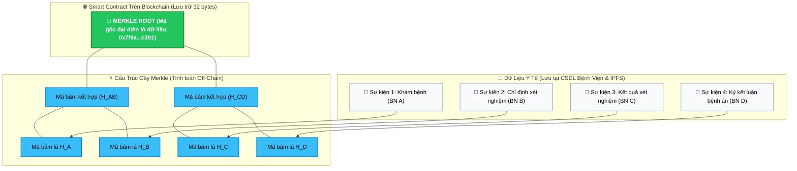
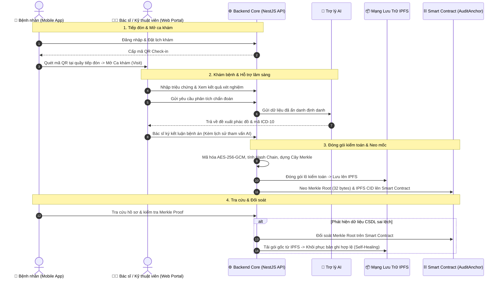
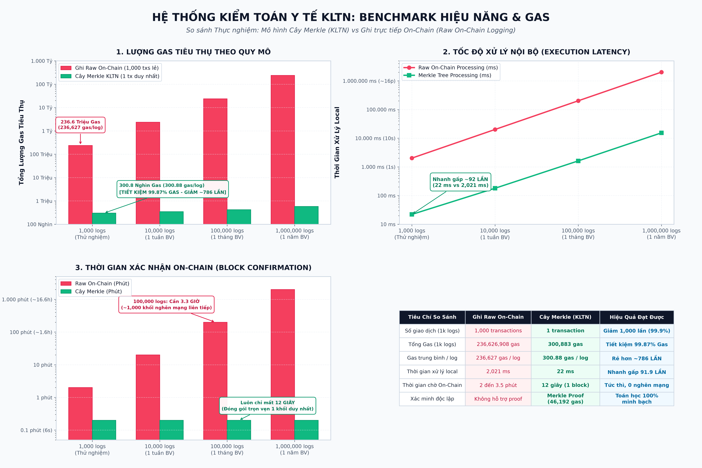
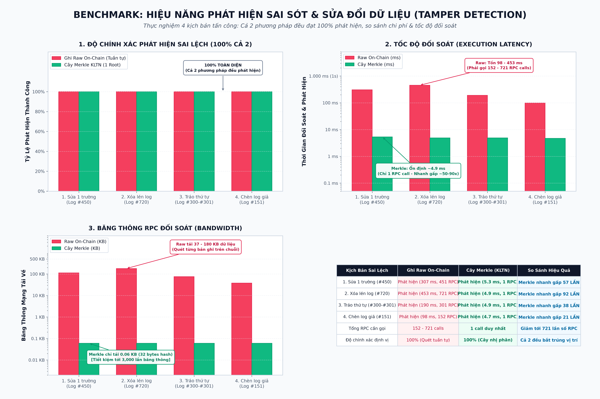

# Hệ Thống Quản Lý Bệnh Viện Thông Minh Tích Hợp Bảo Mật Sinh Trắc Học & Chuỗi Nhật Ký Kiểm Toán Chống Can Thiệp

[](apps/hospital-api)
[](apps/hospital-web)
[](apps/hospital-mobile)
[](apps/audit-contracts)
[](apps/hospital-api)
[-brightgreen)](apps/hospital-api)

> 🌐 **Ngôn ngữ / Language:** **[Tiếng Việt](README.md)** | **[English](README.en.md)**

---

## 🏥 1. Dự Án Này Để Làm Gì & Giải Quyết Vấn Đề Gì?

### ❓ Bài toán thực tế trong quản lý hồ sơ y tế:
Trong các hệ thống quản lý bệnh viện truyền thống:
- Hồ sơ bệnh án, kết quả xét nghiệm và đơn thuốc được lưu trữ tập trung tại cơ sở dữ liệu (như PostgreSQL, MySQL).
- **Vấn đề tồn tại:** Cơ sở dữ liệu tập trung có nguy cơ bị can thiệp trực tiếp bởi quản trị viên, người dùng nội bộ có quyền truy cập cao, hoặc kẻ tấn công xâm nhập máy chủ. Các thao tác chỉnh sửa hoặc xóa dữ liệu trực tiếp trong CSDL có thể làm thay đổi lịch sử khám chữa bệnh mà không để lại bằng chứng toán học độc lập.
- Khi cần đối soát hoặc giải quyết tranh chấp pháp lý, các bên liên quan khó có thể xác minh độc lập tính nguyên bản của dữ liệu nếu chỉ dựa vào hệ thống lưu trữ nội bộ của bệnh viện.

### 💡 Mục tiêu của dự án:
Dự án xây dựng **Hệ Thống Quản Lý Bệnh Viện (HIS)** kết hợp **Blockchain**, **IPFS** và **Cây Merkle (Merkle Tree)** nhằm:
1. **Đảm bảo tính toàn vẹn của nhật ký kiểm toán:** Mọi thao tác chuyên môn (khám bệnh, chỉ định xét nghiệm, kê đơn, kết luận bệnh án) đều được tạo mã băm mật mã học và neo mốc kiểm toán lên Blockchain.
2. **Phát hiện sai lệch & hỗ trợ phục hồi dữ liệu (Self-Healing):** Nếu dữ liệu trong cơ sở dữ liệu bị chỉnh sửa không khớp với mốc đã neo, hệ thống sẽ phát hiện vị trí sai lệch và hỗ trợ phục hồi lại bản ghi gốc từ kho lưu trữ IPFS.
3. **Tích hợp Trợ lý AI hỗ trợ lâm sàng:** Cung cấp gợi ý chẩn đoán dựa trên triệu chứng và kết quả xét nghiệm, đồng thời ghi vết kiểm toán minh bạch toàn bộ quyết định phê duyệt của bác sĩ.

---

## ⚠️ 2. Hạn Chế Khi Lưu Trữ Trực Tiếp Dữ Liệu Y Tế Lên Blockchain

Việc lưu trữ toàn bộ hồ sơ y tế trực tiếp lên chuỗi khối (On-Chain) gặp phải các rào cản kỹ thuật:

| Hạn chế của Blockchain | Phân tích kỹ thuật |
|---|---|
| 💸 **Chi phí lưu trữ (Gas fee)** | Chi phí lưu trữ dữ liệu trạng thái trên Blockchain tỉ lệ thuận với dung lượng. Các tệp dữ liệu y tế như ảnh X-quang, MRI, kết quả xét nghiệm chi tiết có dung lượng lớn, dẫn đến chi phí duy trì cao nếu ghi trực tiếp. |
| 🔓 **Quy định quyền riêng tư (Privacy & PII)** | Dữ liệu trên Blockchain có tính chất công khai và không thể xóa bỏ. Lưu trữ trực tiếp thông tin định danh cá nhân (PII) và lịch sử bệnh lý của bệnh nhân vi phạm các quy định bảo vệ dữ liệu y tế (HIPAA, GDPR). |
| ⏳ **Băng thông và độ trễ giao dịch** | Tốc độ xử lý khối và giới hạn gas mỗi khối của Blockchain không phù hợp với tần suất giao dịch cao trong quy trình khám chữa bệnh hàng ngày. |

---

## 💡 3. Giải Pháp Áp Dụng: Cây Merkle (Merkle Tree) & Mô Hình Lai (Hybrid Architecture)

Để cân bằng giữa chi phí, quyền riêng tư và tính toàn vẹn dữ liệu, hệ thống triển khai **Mô hình kiến trúc lai (Hybrid On-chain / Off-chain)** sử dụng **Cây Merkle (Merkle Tree)**.

### 🌳 Nguyên lý hoạt động:
1. Dữ liệu chi tiết của từng sự kiện kiểm toán được lưu tại cơ sở dữ liệu nội bộ và đóng gói mã hóa lên mạng lưu trữ IPFS.
2. Mỗi bản ghi được băm thành một mã băm lá (Leaf Hash) 32 bytes theo chuỗi tuần tự (Hash Chain).
3. Các mã băm lá được ghép cặp và băm phân cấp thành Cây Merkle để tạo ra một **Merkle Root (32 bytes)** đại diện cho toàn bộ lô dữ liệu.
4. Hệ thống chỉ gửi duy nhất **mã Merkle Root 32 bytes** lên Smart Contract trên Blockchain để làm mốc đối soát.

---

### 🖼️ Sơ Đồ Cấu Trúc Cây Merkle & Mốc Neo Dữ Liệu



---

### 🔍 Quy trình xác thực tính toàn vẹn (Merkle Proof)

Khi cần xác minh một bản ghi bất kỳ (ví dụ: Bản ghi B):
1. Hệ thống tính mã băm của bản ghi: $H_B$.
2. Sử dụng đường dẫn chứng thực Merkle Proof gồm các mã băm liền kề ($H_A$ và $H_{CD}$).
3. Tính toán lại mã gốc:
   $$H_B + H_A \xrightarrow{\text{SHA-256}} H_{AB}$$
   $$H_{AB} + H_{CD} \xrightarrow{\text{SHA-256}} \text{Merkle Root}$$
4. So khớp kết quả với **Merkle Root đã lưu trên Blockchain**:
   - Nếu **Trùng khớp**: Dữ liệu đảm bảo tính toàn vẹn, không bị sửa đổi.
   - Nếu **Sai lệch**: Bản ghi đã bị can thiệp trái phép so với thời điểm neo mốc.

---

### 📊 Bảng So Sánh Các Mô Hình Tiếp Cận

| Tiêu chí | Ghi trực tiếp On-Chain | CSDL truyền thống | Mô hình Lai (Merkle + IPFS + Chuỗi) |
|---|:---:|:---:|:---:|
| **Tính toàn vẹn & Chống sửa đổi** | Cao | Phụ thuộc quyền admin | **Cao (Nhờ Merkle Root on-chain)** |
| **Bảo vệ dữ liệu riêng tư (PII)** | Thấp (Dữ liệu công khai) | Nội bộ | **Đảm bảo (Zero PII on-chain)** |
| **Chi phí Gas lưu trữ** | Cao | Thấp | **Tối ưu (32 bytes mỗi lô)** |
| **Hiệu năng xử lý nghiệp vụ** | Chậm (Phụ thuộc block time) | Nhanh | **Nhanh (Xử lý tức thì tại backend)** |
| **Khả năng đối soát & Phục hồi** | Thủ công | Phục hồi từ backup CSDL | **Tự động đối soát và khôi phục từ IPFS** |

---

## 🛠️ 4. Quy Trình Nghiệp Vụ & Chu Ký Kiểm Toán



---

## ⚡ 5. Thực Nghiệm & Đánh Giá Hiệu Năng (Empirical Benchmarks)

Đo kiểm thực nghiệm được thực hiện trên môi trường Hardhat EVM Cancun Node với **1.000 bản ghi nhật ký y tế**:

> 📖 **Xem báo cáo kỹ thuật chi tiết:** [docs/benchmarks/README.md](docs/benchmarks/README.md)

### 📊 Benchmark 1: So sánh Tiêu thụ Gas & Thời gian xử lý (1.000 Logs)

| Chỉ Số Đo Lường | Ghi Raw On-Chain | Cây Merkle (KLTN) | Mức Độ Cải Thiện |
|---|:---:|:---:|:---:|
| **Số lượng giao dịch (Transactions)** | 1.000 transactions | **1 transaction** | 📉 **Giảm 1.000 lần (99,9%)** |
| **Tổng lượng Gas tiêu thụ** | 236.626.908 gas | **300.883 gas** | ⚡ **Tiết kiệm 99,87% Gas** |
| **Chi phí Gas / 1 log** | 236.627 gas / log | **300,88 gas / log** | 💡 **Tối ưu hơn 786,4 lần** |
| **Thời gian xử lý local** | 2.021 ms (~2,02s) | **22 ms** (~0,022s) | ⏱️ **Nhanh hơn 91,9 lần** |
| **Thời gian xác nhận On-Chain** | 2 – 3,5 phút *(8–10 khối)* | **12 giây** *(1 khối duy nhất)* | 🎯 **Không phát sinh nghẽn mạng** |

<p align="center">
  
</p>

---

### 🛡️ Benchmark 2: Khả Năng Phát Hiện Sai Sót Dữ Liệu (Tamper Detection)

Thực nghiệm 4 kịch bản can thiệp dữ liệu: sửa 1 trường dữ liệu, xóa bản ghi, tráo đổi thứ tự và chèn bản ghi mới:

| Kịch Bản Can Thiệp / Sai Lệch | Ghi Raw On-Chain | Cây Merkle (KLTN) | So Sánh Hiệu Quả |
|---|:---:|:---:|:---:|
| **1. Sửa 1 trường dữ liệu (#450)** | Phát hiện *(307 ms, 451 RPC)* | **Phát hiện (5,3 ms, 1 RPC)** | ⚡ Merkle nhanh hơn **57 lần** |
| **2. Xóa bản ghi kiểm toán (#720)** | Phát hiện *(453 ms, 721 RPC)* | **Phát hiện (4,9 ms, 1 RPC)** | 🎯 Merkle nhanh hơn **92 lần** |
| **3. Tráo đổi thứ tự (#300 ⇄ #301)** | Phát hiện *(190 ms, 301 RPC)* | **Phát hiện (4,9 ms, 1 RPC)** | ⚡ Merkle nhanh hơn **38 lần** |
| **4. Chèn bản ghi giả mạo (#151)** | Phát hiện *(98 ms, 152 RPC)* | **Phát hiện (4,7 ms, 1 RPC)** | 🎯 Merkle nhanh hơn **21 lần** |
| **Số lượng RPC Request cần gọi** | 152 – 721 requests | **1 request duy nhất** | 📉 Giảm tới **721 lần** số request RPC |
| **Băng thông tải về (Bandwidth)** | 37 KB – 180 KB | **0,06 KB (32 bytes hash)** | 📉 Tiết kiệm tới **3.000 lần** băng thông |

<p align="center">
  
</p>

---

## 🏛️ 6. Cấu Trúc Toàn Bộ Dự Án (Monorepo)

```text
KLTN/
├── apps/
│   ├── hospital-api/              # Máy chủ Backend (NestJS 10, Prisma, PostgreSQL, Multi-AI Gateway)
│   ├── hospital-web/              # Giao diện Web Bác sĩ, Quản trị viên & Kỹ thuật viên (React + Vite)
│   ├── hospital-mobile/           # Ứng dụng Bệnh nhân Di động (Expo React Native, QR Check-in)
│   └── audit-contracts/           # Bộ Hợp đồng thông minh Smart Contracts (Solidity v0.8.20 + Hardhat)
│
├── infrastructure/                # Cấu hình Docker Compose, Nginx Reverse Proxy, Script triển khai
├── docs/                          # Kho tài liệu kỹ thuật & kiến trúc chuyên sâu
└── README.md                      # Tài liệu tổng quan dự án
```

---

## 🚀 7. Hướng Dẫn Cài Đặt & Khởi Chạy Nhanh (Quick Start)

### Yêu cầu môi trường:
- Node.js $\ge 20.x$, Docker & Docker Compose, Git.

### Bước 1: Khởi động Blockchain Local & Deploy Smart Contracts
```bash
cd apps/audit-contracts
npm install
npm run node
# Mở một cửa sổ terminal khác:
npm run deploy:local
```

### Bước 2: Khởi chạy Backend API
```bash
cd apps/hospital-api
npm install
cp .env.example .env
npx prisma generate
npx prisma db push
npm run start:dev
```
*API sẽ chạy tại:* `http://localhost:3001/api`

### Bước 3: Khởi chạy Giao diện Web Quản trị & Bác sĩ
```bash
cd apps/hospital-web
npm install
cp .env.example .env
npm run dev
```
*Web Portal sẽ chạy tại:* `http://localhost:5173`

### Bước 4: Khởi chạy Ứng dụng Mobile Bệnh nhân
```bash
cd apps/hospital-mobile
npm install
cp .env.example .env
npx expo start
```
*Dùng ứng dụng **Expo Go** trên điện thoại để quét mã QR và trải nghiệm.*

---

## 📖 8. Danh Mục Tài Liệu Kỹ Thuật Chuyên Sâu

- ⚡ **[Báo Cáo Benchmark Hiệu Năng & Khả Năng Phát Hiện Sai Sót](docs/benchmarks/README.md)**
- 🎮 **[Tài Liệu Chi Tiết 16 Controllers Backend & Endpoints](docs/applications/hospital-api/vi/controllers.md)**
- 🎯 **[Tài Liệu Chi Tiết 59 Use Cases Nghiệp Vụ Backend](docs/applications/hospital-api/vi/use-cases.md)**
- 🏗️ **[Tài Liệu Cấu Trúc Hạ Tầng (Audit Engine, Blockchain, Multi-AI)](docs/applications/hospital-api/vi/infrastructure.md)**
- ⛓️ **[Hướng Dẫn Hợp Đồng Thông Minh Smart Contracts](apps/audit-contracts/README.md)**
- 💻 **[Hướng Dẫn Giao Diện Web Quản Trị](apps/hospital-web/README.md)**
- 📱 **[Hướng Dẫn Cổng Bệnh Nhân Mobile](apps/hospital-mobile/README.md)**