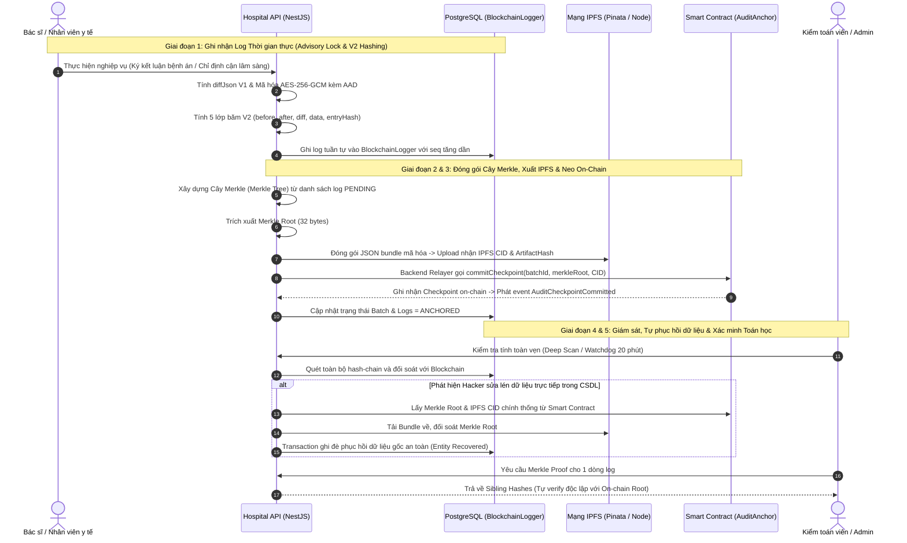

# Hệ Thống Quản Lý Bệnh Viện Thông Minh Tích Hợp Xác Thực Sinh Trắc Học & Chuỗi Nhật Ký Kiểm Toán Chống Can Thiệp (KLTN)

[](apps/hospital-api)
[](apps/hospital-web)
[](apps/hospital-mobile)
[](apps/audit-contracts)
[](apps/hospital-api)
[-brightgreen)](apps/hospital-api)

> 🌐 **Language:** **[Tiếng Việt](README.md)** | **[English](README.en.md)**

---

## 🎯 1. Mục Tiêu & Bối Cảnh Đề Tài Khóa Luận Tốt Nghiệp

Trong ngành y tế số hóa hiện đại, tính toàn vẹn của hồ sơ bệnh án và lịch sử can thiệp điều trị là yếu tố sống còn:
- **Nguy cơ thực tế:** Dữ liệu bệnh án có thể bị nhân viên biến chất, hacker hoặc quản trị viên cơ sở dữ liệu (DBA) sửa đổi, xóa dấu vết hoặc làm giả mạo kết luận chẩn đoán nhằm trục lợi bảo hiểm hoặc che giấu sai sót y khoa.
- **Thách thức về quyền riêng tư:** Dữ liệu y tế (PII, hình ảnh X-Quang, kết quả xét nghiệm) **tuyệt đối không được đưa trực tiếp lên Blockchain công khai** vì vi phạm quyền riêng tư và chi phí lưu trữ khổng lồ.

### 💡 Giải Pháp Đột Phá Của Đề Tài
Đề tài xây dựng một **Hệ Thống Quản Lý Bệnh Viện Toàn Diện (Hospital Information System - HIS)** áp dụng kiến trúc **Kiểm toán 4 lớp bất biến (4-Tier Tamper-Evident Architecture)** kết hợp **Blockchain**, **IPFS** và **Mật mã học hiện đại**:
1. **Chuỗi Băm Đa Tầng Thời Gian Thực (Off-chain Monotonic Hash-Chain V2):** Mọi thao tác nghiệp vụ y tế đều sinh mã băm 5 lớp (`beforeHash`, `afterHash`, `diffHash`, `dataHash`, `entryHash`) và mã hóa dữ liệu với **AES-256-GCM kèm AAD** (Authenticated Additional Data).
2. **Neo Mốc Cây Merkle On-Chain (Blockchain Merkle Anchor):** Toàn bộ nhật ký kiểm toán được gom thành các lô (batch), đóng gói mã hóa lưu lên mạng phân tán **IPFS** và chỉ neo duy nhất mã băm gốc **Merkle Root (32 bytes)** lên Smart Contract `AuditAnchor.sol` (Zero PII on-chain).
3. **Cơ Chế Tự Phục Hồi Dữ Liệu Thông Minh (Self-Healing & Entity Recovery):** Hệ thống tích hợp Watchdog 20 phút chạy nền và chức năng Deep-Scan tự động phát hiện sai lệch khi CSDL bị can thiệp trái phép, từ đó tự động khôi phục dữ liệu gốc từ IPFS Artifact đã xác minh.
4. **Xác Thực Đa Tầng & Bảo Mật Nâng Cao:** Đăng nhập sinh trắc học khuôn mặt (128-d Embedding Cosine similarity), xác thực ví Web3 (EIP-191) cho Quản trị viên và yêu cầu **Face Step-Up MFA** khi thực hiện các hành động nhạy cảm.
5. **Trợ Lý Y Tế AI Đa Nền Tảng (Multi-AI Consultation):** Tích hợp Claude 3.5 Sonnet, GPT-4o, Gemini 1.5 Pro hỗ trợ bác sĩ phân tích lâm sàng có trách nhiệm giải trình và lưu vết y đức.

---

## 🏛️ 2. Cấu Trúc Monorepo

```text
KLTN/
├── apps/
│   ├── hospital-api/              # Backend Core (NestJS 10, Prisma, PostgreSQL, Multi-AI Gateway)
│   ├── hospital-web/              # Web Portal Bác sĩ & Quản trị (React, Vite, Tailwind CSS)
│   ├── hospital-mobile/           # Ứng dụng Bệnh nhân Di động (Expo React Native, QR Check-in)
│   └── audit-contracts/           # Smart Contracts (Solidity v0.8.20, Hardhat, Identity & Audit)
│
├── infrastructure/
│   ├── compose/                   # Cấu hình Docker Compose (Dev, Prod, Test)
│   ├── nginx/                     # Nginx Reverse Proxy & SSL Gateway
│   └── scripts/                   # Shell scripts: Setup, Backup, Hardhat Deploy, Seed demo
│
├── docs/                          # Kho tài liệu kỹ thuật & kiến trúc y tế chuyên sâu
│   └── applications/
│       └── hospital-api/
│           ├── vi/                # Tài liệu chi tiết tiếng Việt (Controllers, UseCases, Infrastructure)
│           └── en/                # Detailed English documentation
│
└── README.md                      # Tài liệu Master tổng quan đề tài
```

---

## 🔄 3. Full Quy Trình Vòng Đời Audit Trail V2 (End-to-End Workflow)

Toàn bộ quy trình kiểm toán từ lúc phát sinh thao tác y khoa đến khi neo mốc trên Blockchain và tự phục hồi dữ liệu được mô tả qua 5 giai đoạn:



### Chi tiết 5 Giai đoạn Kiểm toán:
1. **Giai đoạn 1 (Real-time Mutation):** Mỗi thao tác chạy trong Database Transaction có bọc **PostgreSQL Advisory Lock** (`pg_advisory_xact_lock`), tạo số thứ tự `seq` đơn điệu tăng dần. Dữ liệu trước/sau được mã hóa bằng **AES-256-GCM** với AAD gắn chặt với `seq`, `entity`, `entityId`, `action` chống tráo đổi dữ liệu.
2. **Giai đoạn 2 (Merkle Tree Batching):** Gom các log đang chờ (`PENDING`), xây dựng Cây Merkle chuẩn SHA-256 canonical, trích xuất mã băm gốc `merkleRoot`.
3. **Giai đoạn 3 (IPFS & Blockchain Anchoring):** Toàn bộ lô được xuất thành tệp JSON Artifact mã hóa và tải lên mạng lưu trữ phân tán IPFS. Ví Relayer của backend gọi hàm `AuditAnchor.commitCheckpoint(...)` để lưu vĩnh viễn mốc kiểm toán trên chuỗi khối.
4. **Giai đoạn 4 (Self-Healing & Entity Recovery):** Watchdog tự động chạy nền định kỳ mỗi 20 phút và tính năng Deep-Scan quét so khớp CSDL với Blockchain. Nếu phát hiện bảng nghiệp vụ (`Patient`, `Visit`, `MedicalConclusion`,...) bị sửa đổi hoặc xóa lén, hệ thống tự động tải verified snapshot từ IPFS và phục hồi nguyên trạng.
5. **Giai đoạn 5 (Merkle Inclusion Proof):** Người dùng có thể trích xuất chuỗi băm đường dẫn (sibling hashes) để tự chứng minh tính toàn vẹn của một dòng log bất kỳ với Merkle Root on-chain mà không cần tin tưởng máy chủ backend.

---

## 🔐 4. Mô Hình Phân Quyền & Quản Lý Khóa Web3

Hệ thống phân định 3 vai trò rõ ràng trên Blockchain:

| Vai trò | Vị trí lưu trữ | Chức năng & Nhiệm vụ |
|---|---|---|
| **Owner / Root Governance** | `BLOCKCHAIN_OWNER_PRIVATE_KEY` (Production dùng Ví lạnh / Multisig) | Cấp quyền hoặc thu hồi ví Admin, thêm/xóa ví Relayer, nâng cấp hợp đồng. |
| **Relayer / Backend Writer** | `BLOCKCHAIN_RELAYER_PRIVATE_KEY` trong Secret Manager của Backend | Tự động ký và gửi giao dịch vận hành: neo Merkle root, ghi hash khuôn mặt. |
| **Admin Wallet** | Ví cá nhân của Quản trị viên (MetaMask / EIP-191) | Ký các thử thách xác thực (Challenge) để chứng minh danh tính khi thực hiện các tác vụ nhạy cảm. |

---

## 🚀 5. Hướng Dẫn Cài Đặt & Khởi Chạy Nhanh (Quick Start)

### Bước 1: Khởi động Blockchain Node Local & Deploy Smart Contracts
```bash
cd apps/audit-contracts
npm install
npm run node
# Mở terminal mới:
npm run deploy:local
```

### Bước 2: Cài đặt & Khởi chạy Backend API
```bash
cd apps/hospital-api
npm install
cp .env.example .env
npx prisma generate
npx prisma db push
npm run start:dev
```

### Bước 3: Khởi chạy Frontend Web Portal
```bash
cd apps/hospital-web
npm install
cp .env.example .env
npm run dev
```

### Bước 4: Khởi chạy Ứng dụng Bệnh nhân Mobile
```bash
cd apps/hospital-mobile
npm install
cp .env.example .env
npx expo start
```

---

## 📖 6. Liên Kết Tài Liệu Hướng Dẫn

- 🎮 **[Tài Liệu Chi Tiết Các Controller Backend](docs/applications/hospital-api/vi/controllers.md)**
- 🎯 **[Tài Liệu Chi Tiết Use Cases Nghiệp Vụ Backend](docs/applications/hospital-api/vi/use-cases.md)**
- 🏗️ **[Tài Liệu Chi Tiết Cấu Trúc Hạ Tầng Backend](docs/applications/hospital-api/vi/infrastructure.md)**
- ⛓️ **[Hướng Dẫn Smart Contracts](apps/audit-contracts/README.md)**
- 💻 **[Hướng Dẫn Frontend Web Portal](apps/hospital-web/README.md)**
- 📱 **[Hướng Dẫn Ứng Dụng Mobile Patient Portal](apps/hospital-mobile/README.md)**