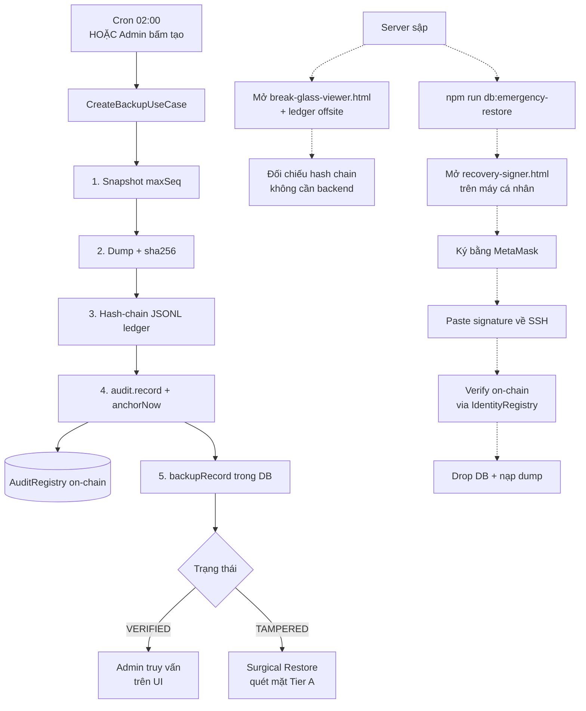

# Quy trình Backup & Khôi phục khẩn cấp

Tài liệu này mô tả toàn bộ vòng đời backup của KLTN HMS và 2 công cụ HTML dùng cho tình huống khẩn cấp:

- **Tự động backup hằng ngày** + **Admin tạo backup thủ công**
- **`tools/break-glass-viewer/`** — kiểm tra tính toàn vẹn của sổ backup (read-only, offline)
- **`tools/recovery-signer/`** (bản sync: `frontend/public/recovery-signer.html`) — ký số ngoại băng để khôi phục database (write, qua MetaMask)

---

## 1. Backup chạy như thế nào

Mỗi backup tạo ra **đồng thời 3 dấu vết**, không thứ nào tin một mình được — chính sự nhất quán giữa 3 dấu vết này mới là bằng chứng:

| Dấu vết | Vị trí | Vai trò |
|---|---|---|
| **Tệp dump** | Storage (Cloudinary / disk offsite) | Dữ liệu nguyên bản để khôi phục |
| **Sổ JSONL** (`backup-ledger.jsonl`) | Volume offsite, append-only | Hash-chain các manifest, sống sót khi DB chết |
| **`BlockchainLogger` + Anchor** | DB + on-chain `AuditRegistry` | Neo `(sha256, maxSeq, createdAt)` ngay (Tier-A) |

### 1.1 Use-case `CreateBackupUseCase`

Mọi backup (cron lẫn admin) đều đi qua use-case này (`backend/src/modules/backup/application/use-cases/create-backup.use-case.ts`):

```text
1. Snapshot maxSeq      → seq mới nhất trong BlockchainLogger,
                          cố định "ranh giới" của bản dump
2. Tạo dump + sha256    → hash bytes của file dump để chống sửa hậu kỳ
3. Hash-chain ledger    → entryHash = SHA256(pepper | code | sha256
                                              | maxSeq | createdAt
                                              | prevHash | canonical)
                          → append vào backup-ledger.jsonl (offsite)
4. Anchor on-chain      → audit.record(SystemBackup) + anchorNow()
                          → seal ngay trên AuditRegistry (Tier-A)
5. Mirror vào DB        → backupRecord (để Admin truy vấn UI)
```

**Tại sao Tier-A neo ngay (không gom batch):** một bản backup có giá trị bằng chứng — nếu để 5 phút sau mới neo, kẻ tấn công có thể tampering manifest trong cửa sổ đó. Neo ngay thì sha256 + maxSeq được seal on-chain trước khi response trả về Admin.

### 1.2 Lịch chạy

| Loại | Khi nào | Trigger | Step-up |
|---|---|---|---|
| **Tự động** | 02:00 sáng hằng ngày | `BackupSchedulerService` (`setTimeout`) | Không (system-initiated) |
| **Thủ công (Admin)** | Admin chủ động trên UI | `POST /backup` | **Tier A** — quét mặt mỗi lần |

**Cấu hình cron:**
- `BACKUP_CRON_ENABLED=true|false` — bật/tắt cron
- `BACKUP_CRON_HOUR=2` — giờ chạy (0–23)

### 1.3 Admin tự backup thủ công

**Truy cập:** Dashboard Admin → **Sao lưu & Khôi phục** (route `/admin/backup`).

**Quyền:** chỉ `ADMIN`.

**Quy trình UI:**
1. Mở trang Backup → bấm **"Tạo bản backup mới"**.
2. Modal **FaceStepUpModal** (Tier A — ticket dùng 1 lần) bật lên: quét khuôn mặt.
3. Backend xác minh ticket → chạy `CreateBackupUseCase` → trả về `{ backupCode, sha256, anchored }`.
4. UI cập nhật danh sách backup, hiển thị huy hiệu trạng thái blockchain (VERIFIED / TAMPERED / UNANCHORED).

**Khi nào nên backup thủ công:**
- Trước khi chạy migration / thay đổi schema lớn.
- Trước khi nhập dữ liệu hàng loạt.
- Sau khi phát hiện bất thường, để có "ảnh chụp" trước/sau.
- Trước khi bảo trì kéo dài.

> [!IMPORTANT]
> Backup thủ công không thay thế cron. Cron đảm bảo có ít nhất 1 bản/ngày dù Admin quên. Admin tạo thêm khi cần "checkpoint" gần một sự kiện cụ thể.

### 1.4 Surgical Restore (khôi phục phẫu thuật)

Khác với "rollback toàn DB", **Surgical Restore** chỉ phục hồi các bản ghi bị tampered, dùng snapshot đã neo on-chain làm nguồn chân thật:

1. Admin chọn các record cần khôi phục trên UI (đang hiện trạng thái TAMPERED).
2. Quét mặt (Tier A — single-use).
3. Backend duyệt từng record:
   - Lấy snapshot anchored gần nhất từ `BlockchainLogger.afterJson`.
   - Xác minh Merkle inclusion proof on-chain.
   - Update DB trong 1 transaction.
4. Ghi audit log `RESTORE` + `anchorNow()` ngay.

**Không mất dữ liệu hợp lệ:** mọi thay đổi hợp pháp ở record khác sau thời điểm tamper được giữ nguyên.

---

## 2. So sánh 2 công cụ HTML khẩn cấp

Cả hai đều là **trang HTML tĩnh, không phụ thuộc backend** — đó là chủ đích thiết kế: khi server/DB sập thì các công cụ này vẫn dùng được. Nhưng **mục đích và cách dùng hoàn toàn khác nhau**:

| Tiêu chí | `tools/break-glass-viewer/` | `tools/recovery-signer/` |
|---|---|---|
| **Mục đích** | Đọc + xác minh sổ backup | Ký challenge để khôi phục DB |
| **Hành vi** | Read-only (xem, đối chiếu hash) | Write (sản sinh chữ ký Web3) |
| **Yêu cầu** | Chỉ cần file `backup-ledger.jsonl` | MetaMask + ví Admin trên `IdentityRegistry` |
| **Internet** | Không cần (zero-dependency) | Không cần (Tailwind/font CDN tùy chọn) |
| **Đầu vào** | File JSONL + AUDIT_PEPPER (tùy chọn) | Chuỗi `EMERGENCY_DATABASE_RESTORE_CHALLENGE:...` |
| **Đầu ra** | Báo cáo "TOÀN VẸN/PHÁT HIỆN BẤT THƯỜNG" | Chuỗi chữ ký hex `0x...` |
| **Vị trí lưu** | Đặt cùng file ledger ở **offsite** | Source code repo / Github Pages / USB Admin |
| **Ai dùng** | Bất cứ kiểm toán viên nào có file ledger | Chỉ Admin có wallet Superadmin |

### 2.1 `tools/break-glass-viewer/` — Trình xác minh sổ backup

**Mục đích:** Khi cần chứng minh "lịch sử backup không bị thay đổi", mở file này không cần backend, không cần internet, kéo thả `backup-ledger.jsonl` vào → công cụ kiểm tra:

1. **Liên kết chuỗi (linkage):** mỗi dòng `prevHash` phải khớp `entryHash` của dòng trước → phát hiện xóa / chèn / đảo dòng. **Không cần secret nào**, dùng được bởi bất kỳ ai có file.
2. **Toàn vẹn nội dung (entryHash):** nếu nhập đúng `AUDIT_PEPPER`, nó tính lại `entryHash` của từng dòng theo đúng công thức backend → nếu lệch là nội dung dòng đó đã bị sửa hoặc pepper sai.

**Tại sao công cụ này tồn tại:**
- Sổ `backup-ledger.jsonl` để **offsite** trên volume riêng — server chính có thể bị xóa nhưng file này vẫn còn.
- Khi server sập, ai mở file ledger ra cũng có thể tự kiểm chứng được nó chưa bị chỉnh sửa, chỉ với 1 file HTML duy nhất chạy bằng `file://` trên trình duyệt.
- Pure JS SHA-256 (~40 dòng) tránh mọi quirk của `window.crypto.subtle` ở chế độ `file://` (một số browser khóa subtle crypto khi không phải secure context).

**Cách truy cập:**
1. Sao chép thư mục `tools/break-glass-viewer/` ra **cùng volume** với `backup-ledger.jsonl` (USB, ổ NAS riêng…).
2. Click đúp để mở bằng trình duyệt (Chrome / Edge / Firefox đều OK).
3. Kéo thả `backup-ledger.jsonl` vào vùng được chỉ định.
4. (Tùy chọn) Nhập `AUDIT_PEPPER` để xác minh đầy đủ entryHash — pepper được lấy từ `.env` của backend (chỉ Admin được biết).
5. Đọc bảng kết quả: số bản backup, trạng thái liên kết chuỗi, số bản đã neo on-chain, tx hash từng bản.

> [!TIP]
> Nếu bạn chỉ muốn chứng minh "không bị chèn/xóa/đảo dòng", **không cần pepper** vẫn đủ — đó là tính chất của hash chain.

### 2.2 `tools/recovery-signer/` — Ký số ngoại băng

**Mục đích:** Khi DB bị xóa / mã hóa, **không có User để đăng nhập**, dữ liệu sinh trắc học cũng không tin được nữa → cần một "chìa khóa gốc" thay thế. Hệ thống dùng **wallet Web3 của Admin** đã đăng ký trên contract `IdentityRegistry` làm root of trust.

**Cách công cụ này hoạt động** (kết hợp với script `npm run db:emergency-restore`):

1. Trên server, Admin chạy `npm run db:emergency-restore /path/to/dump.sql`.
2. Script in ra một **challenge ngẫu nhiên** dạng:
   ```
   EMERGENCY_DATABASE_RESTORE_CHALLENGE:<randomHex>:<timestamp>
   ```
3. Admin mở `recovery-signer.html` trên **máy cá nhân** (không phải server đang sập), kết nối MetaMask, dán challenge, ký.
4. MetaMask trả về chữ ký hex `0x...`.
5. Admin paste chữ ký lại vào terminal.
6. Script:
   - Khôi phục địa chỉ ví từ `(challenge, signature)` bằng `ethers.verifyMessage`.
   - Gọi `IdentityRegistry.owner()` + `isAuthorized(address)` trên-chain để kiểm tra ví có quyền Superadmin không.
   - Nếu hợp lệ, drop DB cũ + nạp dump qua `psql`.

**Tại sao tách ngoại băng (out-of-band):** server đang sập / bị xâm nhập **không được tin nữa**. Nếu cho server tự kiểm tra signer, mã độc có thể giả mạo. Đẩy việc ký sang **máy cá nhân của Admin với MetaMask** đảm bảo:
- Khóa private không bao giờ rời khỏi MetaMask.
- Server compromised không thể giả mạo chữ ký.
- Việc kiểm tra quyền chạy trên blockchain (immutable) chứ không phải DB (đang bị nghi ngờ).

**Cách truy cập:**

| Cách | Khi nào |
|---|---|
| Mở `tools/recovery-signer/index.html` bằng `file://` | Tình huống bình thường — Admin có repo trên máy cá nhân |
| Truy cập tại `https://<your-frontend>/recovery-signer.html` | Khi frontend còn chạy — bản sync ở `frontend/public/` được Vite serve |
| Host độc lập trên Github Pages / S3 / USB | **Khuyến nghị nhất** — hoàn toàn cách ly khỏi infra đang sập |

> [!CAUTION]
> Đừng host file này trong cùng infra với server đang restore — nếu hacker đã chiếm infra đó, họ có thể chỉnh sửa HTML để đánh cắp chữ ký. Lý tưởng: USB của Admin hoặc Github Pages riêng của Admin.

**Yêu cầu sẵn có:**
- MetaMask cài trên trình duyệt máy cá nhân Admin.
- Wallet đã đăng ký quyền Admin trong contract `IdentityRegistry` (qua script deploy).
- File backup `.sql` đặt trên server (qua SSH/SCP).

---

## 3. Sơ đồ vòng đời 1 bản backup



---

## 4. Bảng tham chiếu nhanh

| Tình huống | Công cụ dùng | Ai dùng |
|---|---|---|
| Tạo backup hằng ngày | Cron tự động (02:00) | Hệ thống |
| Admin chủ động "checkpoint" | UI Admin → /admin/backup | Admin (Tier A face scan) |
| Sửa vài record bị tampered, giữ phần còn lại | Surgical Restore trên UI | Admin (Tier A face scan) |
| Kiểm chứng sổ backup chưa bị chỉnh | `tools/break-glass-viewer/` | Bất kỳ ai có file ledger |
| DB toàn bộ bị xóa, không đăng nhập được | `tools/recovery-signer/` + `npm run db:emergency-restore` | Admin có wallet Superadmin |

---

## 5. File liên quan trong codebase

| File | Vai trò |
|---|---|
| `backend/src/modules/backup/application/use-cases/create-backup.use-case.ts` | Tạo backup (cron + manual) |
| `backend/src/modules/backup/application/use-cases/surgical-restore.use-case.ts` | Khôi phục từng record bị tampered |
| `backend/src/modules/backup/infrastructure/.../backup-scheduler.service.ts` | Cron 02:00 |
| `backend/src/scripts/emergency-restore.ts` | CLI script ngoại băng |
| `docs/backup-recovery/emergency-restore.md` | Hướng dẫn chi tiết quy trình SSH |
| `tools/break-glass-viewer/index.html` | Trình xem sổ backup offline |
| `tools/recovery-signer/index.html` | Trang ký Web3 ngoại băng (canonical) |
| `frontend/public/recovery-signer.html` | Bản sync để Vite serve |
| `frontend/src/features/admin/pages/BackupPage.jsx` | UI Admin quản lý backup |
