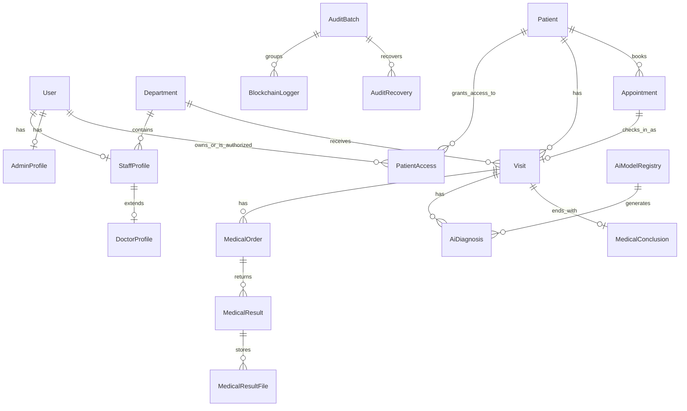

# Từ điển dữ liệu & ERD — Hospital Management System

**Nguồn chuẩn:** [`schema.prisma`](../../apps/hospital-api/prisma/schema.prisma) · **ERD SQL rút gọn:** [`database-erd.sql`](database-erd.sql) · **CSDL:** PostgreSQL + Prisma.

> [!IMPORTANT]
> Tài liệu này mô tả **22 model đang được dùng**. Các bảng `AuditLog`, `RefreshToken`, `OtpVerification` **đã ngừng dùng và bị loại khỏi tài liệu** (xem mục cuối) — model vẫn còn trong Prisma/code nhưng **không xoá trong code**.
> `database-erd.sql` chỉ để dựng sơ đồ. Kiểu `String` của Prisma được tạo là `TEXT`, `DateTime` là `TIMESTAMP(3)`, `Float` là `DOUBLE PRECISION`, `Int` là `INTEGER`.

## Quy ước bảng thuộc tính

- **PK**: khóa chính; **FK**: khóa ngoại; **UQ**: duy nhất; **NN**: bắt buộc; **NULL**: có thể trống.
- Cột **Ghi chú** chỉ ghi những đặc điểm chính: ràng buộc khóa, mặc định, và ý nghĩa nghiệp vụ quan trọng.

## Tổng quan quan hệ

## Enum và miền giá trị

| Enum | Miền giá trị | Ý nghĩa |
|---|---|---|
| `UserRole` | ADMIN, RECEPTIONIST, DOCTOR, LAB_MANAGER, PATIENT | Vai trò RBAC của tài khoản. |
| `UserStatus` | ACTIVE, INACTIVE, PENDING, DELETE | Vòng đời tài khoản. |
| `PatientRelationship` | SELF, CHILD, PARENT, SPOUSE, GUARDIAN, OTHER | Quan hệ chủ tài khoản với hồ sơ bệnh nhân. |
| `PatientAccessStatus` | ACTIVE, PENDING, REVOKED | Hiệu lực quyền truy cập hồ sơ bệnh nhân. |
| `DepartmentType` | ADMINISTRATIVE, EXAMINATION, CLINICAL, LABORATORY, IMAGING, PHARMACY, OTHER | Loại đơn vị vận hành; không đồng nghĩa chuyên khoa bác sĩ. |
| `OperationalStatus` | ACTIVE, INACTIVE, DELETE | Trạng thái vận hành phòng ban/mô hình AI. |
| `LabSpecialty` | LABORATORY, IMAGING, BOTH | Năng lực cận lâm sàng của nhân sự. |
| `MedicalSpecialty` | GENERAL_INTERNAL_MEDICINE, GENERAL_SURGERY, PEDIATRICS, OBSTETRICS_GYNECOLOGY, CARDIOLOGY, ENT, DENTOMAXILLOFACIAL, OPHTHALMOLOGY, DERMATOLOGY, NEUROLOGY, ORTHOPEDICS, GASTROENTEROLOGY, ENDOCRINOLOGY, ONCOLOGY, RESPIRATORY | Chuyên môn lâm sàng của bác sĩ; dùng khi chọn bác sĩ/AI. |
| `AppointmentStatus` | PENDING, CONFIRMED, CHECKED_IN, CANCELLED, EXPIRED, NO_SHOW | Vòng đời lịch hẹn. |
| `VisitSource` | WALK_IN, APPOINTMENT | Lượt khám vãng lai hoặc sinh từ lịch hẹn QR. |
| `VisitStatus` | WAITING, IN_PROGRESS, WAITING_TEST_RESULT, WAITING_CONCLUSION, COMPLETED, CANCELLED | State machine lượt khám. |
| `MedicalOrderStatus` | ORDERED, IN_PROGRESS, RESULT_READY, CANCELLED | Vòng đời chỉ định cận lâm sàng. |

---

## 1. Định danh, nhân sự và phân quyền

### `User` — tài khoản hệ thống

Tài khoản gốc của toàn hệ thống, chứa thông tin đăng nhập, vai trò RBAC, trạng thái vòng đời, dữ liệu sinh trắc khuôn mặt và các cơ chế bảo mật (nonce chống replay, khóa brute-force, vô hiệu token).

| STT | Thuộc tính | Diễn giải | Kiểu dữ liệu | Chiều dài | Miền giá trị | Ghi chú |
|---:|---|---|---|---|---|---|
| 1 | `id` | Định danh tài khoản | TEXT | Không giới hạn | UUID | PK, NN |
| 2 | `username` | Tên đăng nhập của nhân sự/quản trị viên | TEXT | Không giới hạn | Duy nhất hoặc NULL | UQ |
| 3 | `email` | Email dùng để đăng nhập/liên hệ | TEXT | Không giới hạn | Duy nhất hoặc NULL | UQ |
| 4 | `phone` | Số điện thoại của tài khoản | TEXT | Không giới hạn | NULL | |
| 5 | `phoneNormalized` | Số điện thoại đã chuẩn hoá, phục vụ tra cứu/xác thực | TEXT | Không giới hạn | UQ hoặc NULL | UQ |
| 6 | `passwordHash` | Mật khẩu đã băm (không lưu plaintext) | TEXT | Không giới hạn | NULL | Bảo mật |
| 7 | `role` | Vai trò RBAC quyết định quyền truy cập | UserRole | — | `UserRole` | NN |
| 8 | `status` | Trạng thái vòng đời tài khoản | UserStatus | — | `UserStatus` | NN, default PENDING |
| 9 | `firstLogin` | Cờ đăng nhập lần đầu, kích hoạt luồng onboarding | BOOLEAN | — | true/false | default true |
| 10 | `registrationStep` | Bước onboarding hiện tại (1–4) | INTEGER | — | 1..4 | default 1 |
| 11 | `tokenVersion` | Số phiên bản token, tăng để vô hiệu toàn bộ JWT cũ | INTEGER | — | — | default 0 |
| 12 | `inviteToken` | Token mời nhân sự, xác thực luồng tạo tài khoản | TEXT | Không giới hạn | UQ hoặc NULL | UQ |
| 13 | `inviteTokenExpiry` | Thời điểm hết hạn của token mời | TIMESTAMP(3) | — | NULL khi không dùng | |
| 14 | `faceEmbedding` | Descriptor khuôn mặt 128 chiều đã mã hoá, dùng để so khớp khi verify | TEXT | Không giới hạn | NULL khi chưa đăng ký | Sinh trắc học |
| 15 | `faceHash` | SHA-256 của descriptor set, neo lên blockchain để phát hiện giả mạo | TEXT | Không giới hạn | NULL khi chưa đăng ký | Sinh trắc học |
| 16 | `faceModelVersion` | Phiên bản model nhận diện lúc đăng ký, để biết khi nào cần đăng ký lại | TEXT | Không giới hạn | NULL | Sinh trắc học |
| 17 | `faceEnrolledAt` | Thời điểm đăng ký khuôn mặt thành công | TIMESTAMP(3) | — | NULL | Sinh trắc học |
| 18 | `faceSampleCount` | Số mẫu khuôn mặt đã đăng ký (3–15) | INTEGER | — | NULL | Sinh trắc học |
| 19 | `faceChallenge` | Nonce dùng 1 lần cho lần quét mặt, chống replay | TEXT | Không giới hạn | NULL khi không có phiên quét | Bảo mật |
| 20 | `faceChallengeExpiresAt` | Thời điểm hết hạn của face challenge | TIMESTAMP(3) | — | NULL | Bảo mật |
| 21 | `failedFaceAttempts` | Số lần quét mặt thất bại liên tiếp, phục vụ khoá brute-force | INTEGER | — | — | default 0 |
| 22 | `faceLockedUntil` | Thời điểm hết khoá tạm thời do quá nhiều lần thất bại | TIMESTAMP(3) | — | NULL | |
| 23 | `createdAt` | Mốc tạo tài khoản | TIMESTAMP(3) | — | — | |
| 24 | `updatedAt` | Mốc cập nhật gần nhất | TIMESTAMP(3) | — | — | |
| 25 | `deletedAt` | Mốc xoá mềm tài khoản | TIMESTAMP(3) | — | NULL | Soft delete |
| 26 | `deletedBy` | Người xoá mềm tài khoản | TEXT | Không giới hạn | FK → User.id hoặc NULL | FK tự tham chiếu |
| 27 | `restoredAt` | Mốc khôi phục tài khoản sau xoá mềm | TIMESTAMP(3) | — | NULL | Soft delete |

### `Department` — đơn vị/phòng ban vận hành

Phòng ban tiếp nhận lượt khám và chỉ định cận lâm sàng; có loại hình vận hành riêng, khác với chuyên khoa của bác sĩ.

| STT | Thuộc tính | Diễn giải | Kiểu dữ liệu | Chiều dài | Miền giá trị | Ghi chú |
|---:|---|---|---|---|---|---|
| 1 | `id` | Định danh phòng ban | TEXT | Không giới hạn | UUID | PK, NN |
| 2 | `departmentCode` | Mã phòng ban, dùng hiển thị/tra cứu | TEXT | Không giới hạn | Duy nhất | NN, UQ |
| 3 | `name` | Tên hiển thị phòng ban | TEXT | Không giới hạn | Duy nhất | NN, UQ |
| 4 | `floor` | Tầng/vị trí phòng ban, phục vụ điều phối | TEXT | Không giới hạn | NULL | |
| 5 | `type` | Loại đơn vị vận hành | DepartmentType | — | `DepartmentType` | NN, default CLINICAL |
| 6 | `status` | Có đang hoạt động hay đã xoá | OperationalStatus | — | `OperationalStatus` | NN, default ACTIVE |
| 7 | `canReceiveOrders` | Có được nhận chỉ định cận lâm sàng hay không | BOOLEAN | — | true/false | Chỉ LABORATORY/IMAGING bật; default false |
| 8 | `description` | Mô tả thêm về phòng ban | TEXT | Không giới hạn | NULL | |
| 9 | `managerId` | Nhân sự quản lý phòng ban | TEXT | Không giới hạn | FK → StaffProfile.id, NULL | UQ (1–1) |
| 10 | `hash256` | Băm toàn vẹn dữ liệu (SHA-256 pepper + salt + canonical) | TEXT | Không giới hạn | NULL | Chống giả mạo |
| 11 | `dataSalt` | Muối ngẫu nhiên mỗi bản ghi, dùng cùng `hash256` | TEXT | Không giới hạn | NULL | Chống giả mạo |
| 12 | `createdAt` | Mốc tạo phòng ban | TIMESTAMP(3) | — | — | |
| 13 | `updatedAt` | Mốc cập nhật gần nhất | TIMESTAMP(3) | — | — | |
| 14 | `deletedAt` | Mốc xoá mềm | TIMESTAMP(3) | — | NULL | Soft delete |
| 15 | `deletedBy` | Người xoá mềm | TEXT | Không giới hạn | FK → User.id, NULL | FK |
| 16 | `restoredAt` | Mốc khôi phục sau xoá mềm | TIMESTAMP(3) | — | NULL | Soft delete |

### `StaffProfile` — hồ sơ nhân sự

Hồ sơ nhân sự (lễ tân, bác sĩ, quản lý lab...), gắn 1–1 với tài khoản `User` và thuộc về một phòng ban.

| STT | Thuộc tính | Diễn giải | Kiểu dữ liệu | Chiều dài | Miền giá trị | Ghi chú |
|---:|---|---|---|---|---|---|
| 1 | `id` | Định danh hồ sơ nhân sự | TEXT | Không giới hạn | UUID | PK, NN |
| 2 | `userId` | Tài khoản sở hữu hồ sơ | TEXT | Không giới hạn | FK → User.id, NN | UQ (1–1), CASCADE |
| 3 | `departmentId` | Đơn vị nhân sự đang công tác | TEXT | Không giới hạn | FK → Department.id, NULL | FK |
| 4 | `fullName` | Họ tên đầy đủ của nhân sự | TEXT | Không giới hạn | NN | |
| 5 | `phone` | Số điện thoại liên hệ | TEXT | Không giới hạn | NN | |
| 6 | `gender` | Giới tính | TEXT | Không giới hạn | NN | |
| 7 | `citizenId` | CCCD/CMND nhận dạng duy nhất | TEXT | Không giới hạn | UQ | NN, UQ |
| 8 | `birthDate` | Ngày sinh | TIMESTAMP(3) | — | NN | |
| 9 | `address` | Địa chỉ cư trú | TEXT | Không giới hạn | NULL | |
| 10 | `avatarUrl` | Đường dẫn ảnh đại diện | TEXT | Không giới hạn | NN | |
| 11 | `employeeCode` | Mã nhân viên nghiệp vụ | TEXT | Không giới hạn | UQ | NN, UQ |
| 12 | `position` | Chức danh công việc | TEXT | Không giới hạn | NULL | |
| 13 | `labSpecialty` | Năng lực cận lâm sàng (lab/imaging/cả hai) | LabSpecialty | — | NULL | |
| 14 | `createdAt` | Mốc tạo hồ sơ | TIMESTAMP(3) | — | — | |
| 15 | `updatedAt` | Mốc cập nhật gần nhất | TIMESTAMP(3) | — | — | |
| 16 | `hash256` | Băm toàn vẹn dữ liệu | TEXT | Không giới hạn | NULL | Chống giả mạo |
| 17 | `dataSalt` | Muối ngẫu nhiên mỗi bản ghi | TEXT | Không giới hạn | NULL | Chống giả mạo |

### `DoctorProfile` — hồ sơ chuyên môn bác sĩ

Mở rộng 1–1 từ `StaffProfile`, bổ sung chuyên môn lâm sàng và giấy phép hành nghề.

| STT | Thuộc tính | Diễn giải | Kiểu dữ liệu | Chiều dài | Miền giá trị | Ghi chú |
|---:|---|---|---|---|---|---|
| 1 | `id` | Định danh hồ sơ bác sĩ | TEXT | Không giới hạn | UUID | PK, NN |
| 2 | `staffProfileId` | Hồ sơ nhân sự nền của bác sĩ | TEXT | Không giới hạn | FK → StaffProfile.id, NN | UQ (1–1), CASCADE |
| 3 | `specialty` | Chuyên môn lâm sàng | MedicalSpecialty | — | `MedicalSpecialty` | NN |
| 4 | `licenseNumber` | Số giấy phép hành nghề | TEXT | Không giới hạn | UQ | NN, UQ |
| 5 | `qualification` | Bằng cấp/chứng chỉ | TEXT | Không giới hạn | NN | |
| 6 | `yearsExperience` | Số năm kinh nghiệm | INTEGER | — | NULL | |
| 7 | `createdAt` | Mốc tạo hồ sơ | TIMESTAMP(3) | — | — | |
| 8 | `updatedAt` | Mốc cập nhật gần nhất | TIMESTAMP(3) | — | — | |
| 9 | `hash256` | Băm toàn vẹn dữ liệu | TEXT | Không giới hạn | NULL | Chống giả mạo |
| 10 | `dataSalt` | Muối ngẫu nhiên mỗi bản ghi | TEXT | Không giới hạn | NULL | Chống giả mạo |

### `AdminProfile` — hồ sơ quản trị viên

Hồ sơ quản trị, gắn 1–1 với `User`; chứa ví blockchain và dữ liệu xác thực nonce/MFA phục vụ khôi phục ví.

| STT | Thuộc tính | Diễn giải | Kiểu dữ liệu | Chiều dài | Miền giá trị | Ghi chú |
|---:|---|---|---|---|---|---|
| 1 | `id` | Định danh hồ sơ quản trị | TEXT | Không giới hạn | UUID | PK, NN |
| 2 | `userId` | Tài khoản nền của quản trị viên | TEXT | Không giới hạn | FK → User.id, NN | UQ (1–1), CASCADE |
| 3 | `adminUserName` | Tên định danh quản trị | TEXT | Không giới hạn | UQ | NN, UQ |
| 4 | `walletAddress` | Địa chỉ ví blockchain của admin | TEXT | Không giới hạn | UQ hoặc NULL | UQ |
| 5 | `nonce` | Nonce dùng 1 lần cho luồng xác thực ví | TEXT | Không giới hạn | NULL | |
| 6 | `nonceExpiresAt` | Thời điểm hết hạn nonce ví | TIMESTAMP(3) | — | NULL | |
| 7 | `noncePurpose` | Mục đích của nonce (bind/replace wallet...) | TEXT | Không giới hạn | NULL | |
| 8 | `mfaSecret` | Bí mật MFA (TOTP) đã mã hoá của admin | TEXT | Không giới hạn | NULL | Bảo mật |
| 9 | `createdAt` | Mốc tạo hồ sơ | TIMESTAMP(3) | — | — | |
| 10 | `updatedAt` | Mốc cập nhật gần nhất | TIMESTAMP(3) | — | — | |

---

## 2. Bệnh nhân, phân quyền portal và khám bệnh

### `Patient` — hồ sơ người bệnh

Hồ sơ bệnh nhân độc lập với tài khoản; một tài khoản có thể được uỷ quyền truy cập nhiều hồ sơ.

| STT | Thuộc tính | Diễn giải | Kiểu dữ liệu | Chiều dài | Miền giá trị | Ghi chú |
|---:|---|---|---|---|---|---|
| 1 | `id` | Định danh hồ sơ bệnh nhân | TEXT | Không giới hạn | UUID | PK, NN |
| 2 | `patientCode` | Mã bệnh nhân nghiệp vụ, tự sinh nếu không nhập | TEXT | Không giới hạn | UQ | NN, UQ |
| 3 | `fullName` | Họ tên bệnh nhân | TEXT | Không giới hạn | NN | |
| 4 | `gender` | Giới tính | TEXT | Không giới hạn | NN | |
| 5 | `birthDate` | Ngày sinh | TIMESTAMP(3) | — | NN | |
| 6 | `citizenId` | CCCD/CMND nhận dạng duy nhất, chống trùng hồ sơ | TEXT | Không giới hạn | UQ hoặc NULL | UQ |
| 7 | `phone` | Điện thoại liên hệ (cột DB thật: `contactPhone`) | TEXT | Không giới hạn | NULL | |
| 8 | `address` | Địa chỉ cư trú | TEXT | Không giới hạn | NULL | |
| 9 | `insuranceNumber` | Số thẻ BHYT | TEXT | Không giới hạn | NULL | |
| 10 | `emergencyContact` | Thông tin liên hệ khẩn cấp | TEXT | Không giới hạn | NULL | |
| 11 | `createdAt` | Mốc tạo hồ sơ | TIMESTAMP(3) | — | — | |
| 12 | `updatedAt` | Mốc cập nhật gần nhất | TIMESTAMP(3) | — | — | |
| 13 | `hash256` | Băm toàn vẹn dữ liệu, phát hiện giả mạo | TEXT | Không giới hạn | NULL | Chống giả mạo |
| 14 | `dataSalt` | Muối ngẫu nhiên mỗi bản ghi | TEXT | Không giới hạn | NULL | Chống giả mạo |

### `PatientAccess` — ủy quyền tài khoản tới hồ sơ bệnh nhân

Bảng N–N giữa `User` và `Patient`: tài khoản nào được xem hồ sơ nào, với quyền chi tiết từng loại và trạng thái uỷ quyền.

| STT | Thuộc tính | Diễn giải | Kiểu dữ liệu | Chiều dài | Miền giá trị | Ghi chú |
|---:|---|---|---|---|---|---|
| 1 | `id` | Định danh bản ghi uỷ quyền | TEXT | Không giới hạn | UUID | PK, NN |
| 2 | `userId` | Tài khoản được cấp quyền | TEXT | Không giới hạn | FK → User.id, NN | CASCADE; UQ ghép (userId, patientId) |
| 3 | `patientId` | Hồ sơ bệnh nhân được uỷ quyền | TEXT | Không giới hạn | FK → Patient.id, NN | CASCADE; UQ ghép (userId, patientId) |
| 4 | `relationship` | Quan hệ chủ tài khoản với bệnh nhân | PatientRelationship | — | `PatientRelationship` | default SELF |
| 5 | `status` | Hiệu lực của uỷ quyền | PatientAccessStatus | — | `PatientAccessStatus` | default ACTIVE |
| 6 | `canViewProfile` | Quyền xem hồ sơ bệnh nhân | BOOLEAN | — | true/false | default true |
| 7 | `canViewVisits` | Quyền xem lịch sử lượt khám | BOOLEAN | — | true/false | default true |
| 8 | `canViewResults` | Quyền xem kết quả cận lâm sàng | BOOLEAN | — | true/false | default true |
| 9 | `canBookVisit` | Quyền đặt lịch hẹn | BOOLEAN | — | true/false | default false |
| 10 | `verifiedAt` | Mốc xác thực uỷ quyền | TIMESTAMP(3) | — | NULL | |
| 11 | `verifiedById` | Người xác thực uỷ quyền | TEXT | Không giới hạn | FK → User.id, NULL | SET NULL |
| 12 | `revokedAt` | Mốc thu hồi uỷ quyền | TIMESTAMP(3) | — | NULL | |
| 13 | `createdAt` | Mốc tạo uỷ quyền | TIMESTAMP(3) | — | — | |
| 14 | `updatedAt` | Mốc cập nhật gần nhất | TIMESTAMP(3) | — | — | |

### `Visit` — lượt khám

Một lần khám của bệnh nhân tại một phòng ban, theo state machine trạng thái từ chờ đến hoàn tất.

| STT | Thuộc tính | Diễn giải | Kiểu dữ liệu | Chiều dài | Miền giá trị | Ghi chú |
|---:|---|---|---|---|---|---|
| 1 | `id` | Định danh lượt khám | TEXT | Không giới hạn | UUID | PK, NN |
| 2 | `visitCode` | Mã lượt khám hiển thị | TEXT | Không giới hạn | UQ | NN, UQ |
| 3 | `patientId` | Bệnh nhân của lượt khám | TEXT | Không giới hạn | FK → Patient.id, NN | FK |
| 4 | `departmentId` | Nơi tiếp nhận lượt khám | TEXT | Không giới hạn | FK → Department.id, NN | FK |
| 5 | `staffId` | Nhân sự/bác sĩ phụ trách | TEXT | Không giới hạn | FK → StaffProfile.id, NULL | FK |
| 6 | `status` | Trạng thái state machine của lượt khám | VisitStatus | — | `VisitStatus` | default WAITING |
| 7 | `source` | Nguồn tạo lượt khám | VisitSource | — | `VisitSource` | default WALK_IN |
| 8 | `checkInAt` | Mốc check-in | TIMESTAMP(3) | — | — | default now |
| 9 | `completedAt` | Mốc hoàn tất khám | TIMESTAMP(3) | — | NULL khi chưa xong | |
| 10 | `createdAt` | Mốc tạo lượt khám | TIMESTAMP(3) | — | — | |
| 11 | `updatedAt` | Mốc cập nhật gần nhất | TIMESTAMP(3) | — | — | |

### `Appointment` — lịch hẹn khám

Lịch hẹn của bệnh nhân với phòng ban/bác sĩ; check-in qua QR sẽ sinh ra lượt khám tương ứng.

| STT | Thuộc tính | Diễn giải | Kiểu dữ liệu | Chiều dài | Miền giá trị | Ghi chú |
|---:|---|---|---|---|---|---|
| 1 | `id` | Định danh lịch hẹn | TEXT | Không giới hạn | UUID | PK, NN |
| 2 | `appointmentCode` | Mã lịch hẹn hiển thị | TEXT | Không giới hạn | UQ | NN, UQ |
| 3 | `patientId` | Người bệnh đặt hẹn | TEXT | Không giới hạn | FK → Patient.id, NN | FK |
| 4 | `departmentId` | Phòng ban được hẹn | TEXT | Không giới hạn | FK → Department.id, NN | FK |
| 5 | `doctorId` | Bác sĩ được hẹn (nếu có) | TEXT | Không giới hạn | FK → DoctorProfile.id, NULL | FK |
| 6 | `scheduledAt` | Thời điểm hẹn khám | TIMESTAMP(3) | — | NN | |
| 7 | `status` | Vòng đời lịch hẹn | AppointmentStatus | — | `AppointmentStatus` | default CONFIRMED |
| 8 | `qrTokenHash` | Hash QR token tìm lịch khi check-in; raw token không lưu DB | TEXT | Không giới hạn | UQ | UQ, bảo mật |
| 9 | `qrExpiresAt` | Thời điểm hết hạn QR | TIMESTAMP(3) | — | NN | |
| 10 | `checkedInAt` | Thời điểm check-in thành công | TIMESTAMP(3) | — | NULL nếu chưa đến | |
| 11 | `visitId` | Lượt khám sinh ra khi check-in QR | TEXT | Không giới hạn | FK → Visit.id, NULL | UQ (1–1) |
| 12 | `cancelledAt` | Mốc huỷ hẹn | TIMESTAMP(3) | — | NULL nếu không huỷ | |
| 13 | `cancelReason` | Lý do huỷ hẹn | TEXT | Không giới hạn | NULL | |
| 14 | `createdByUserId` | Người dùng tạo lịch hẹn | TEXT | Không giới hạn | FK → User.id, NULL | SET NULL |
| 15 | `createdAt` | Mốc tạo lịch hẹn | TIMESTAMP(3) | — | — | |
| 16 | `updatedAt` | Mốc cập nhật gần nhất | TIMESTAMP(3) | — | — | |

---

## 3. Cận lâm sàng (chỉ định và kết quả)

### `MedicalOrder` — phiếu chỉ định cận lâm sàng

Chỉ định xét nghiệm/chẩn đoán hình ảnh do bác sĩ tạo, gửi đến phòng ban lab/imaging.

| STT | Thuộc tính | Diễn giải | Kiểu dữ liệu | Chiều dài | Miền giá trị | Ghi chú |
|---:|---|---|---|---|---|---|
| 1 | `id` | Định danh phiếu chỉ định | TEXT | Không giới hạn | UUID | PK, NN |
| 2 | `orderCode` | Mã phiếu chỉ định hiển thị | TEXT | Không giới hạn | UQ | NN, UQ |
| 3 | `visitId` | Lượt khám sở hữu chỉ định | TEXT | Không giới hạn | FK → Visit.id, NN | FK |
| 4 | `patientId` | Bệnh nhân của chỉ định (tra cứu nhanh) | TEXT | Không giới hạn | FK → Patient.id, NN | FK |
| 5 | `doctorId` | Bác sĩ chịu trách nhiệm chỉ định | TEXT | Không giới hạn | FK → DoctorProfile.id, NN | FK |
| 6 | `targetDepartmentId` | Phòng lab/chẩn đoán hình ảnh nhận chỉ định | TEXT | Không giới hạn | FK → Department.id, NULL | Chỉ nhận nếu ACTIVE + canReceiveOrders |
| 7 | `orderType` | Loại chỉ định (xét nghiệm/chụp chiếu...) | TEXT | Không giới hạn | NN | |
| 8 | `priority` | Độ ưu tiên xử lý | TEXT | Không giới hạn | — | default NORMAL |
| 9 | `clinicalNote` | Ghi chú lâm sàng kèm chỉ định | TEXT | Không giới hạn | NULL | |
| 10 | `status` | Vòng đời phiếu chỉ định | MedicalOrderStatus | — | `MedicalOrderStatus` | default ORDERED |
| 11 | `orderedAt` | Mốc tạo chỉ định | TIMESTAMP(3) | — | — | default now |
| 12 | `completedAt` | Mốc hoàn tất chỉ định | TIMESTAMP(3) | — | NULL | |
| 13 | `createdAt` | Mốc tạo bản ghi | TIMESTAMP(3) | — | — | |
| 14 | `updatedAt` | Mốc cập nhật gần nhất | TIMESTAMP(3) | — | — | |

### `MedicalResult` — kết quả chỉ định

Kết quả trả về cho một phiếu chỉ định, kèm nhận xét và người trả kết quả.

| STT | Thuộc tính | Diễn giải | Kiểu dữ liệu | Chiều dài | Miền giá trị | Ghi chú |
|---:|---|---|---|---|---|---|
| 1 | `id` | Định danh kết quả | TEXT | Không giới hạn | UUID | PK, NN |
| 2 | `resultCode` | Mã kết quả hiển thị | TEXT | Không giới hạn | UQ | NN, UQ |
| 3 | `orderId` | Phiếu chỉ định nguồn của kết quả | TEXT | Không giới hạn | FK → MedicalOrder.id, NN | FK |
| 4 | `performedById` | User thực hiện/trả kết quả | TEXT | Không giới hạn | FK → User.id, NULL | FK |
| 5 | `note` | Nhận xét kèm kết quả | TEXT | Không giới hạn | NULL | |
| 6 | `returnedAt` | Thời điểm trả kết quả | TIMESTAMP(3) | — | — | default now |
| 7 | `createdAt` | Mốc tạo bản ghi | TIMESTAMP(3) | — | — | |
| 8 | `updatedAt` | Mốc cập nhật gần nhất | TIMESTAMP(3) | — | — | |

### `MedicalResultFile` — tệp đính kèm kết quả y tế

Metadata của tệp (hình ảnh/PDF) đính kèm kết quả, lưu trên S3; chỉ lưu địa chỉ object và checksum, không lưu nội dung tệp.

| STT | Thuộc tính | Diễn giải | Kiểu dữ liệu | Chiều dài | Miền giá trị | Ghi chú |
|---:|---|---|---|---|---|---|
| 1 | `id` | Định danh metadata tệp | TEXT | Không giới hạn | UUID | PK, NN |
| 2 | `resultId` | Kết quả sở hữu tệp | TEXT | Không giới hạn | FK → MedicalResult.id, NN | CASCADE |
| 3 | `fileName` | Tên lưu trữ (object key ngắn) | TEXT | Không giới hạn | NN | |
| 4 | `originalName` | Tên gốc người dùng upload | TEXT | Không giới hạn | NN | |
| 5 | `mimeType` | Định dạng tệp (image/png, application/pdf...) | TEXT | Không giới hạn | NN | |
| 6 | `size` | Dung lượng tệp (byte) | INTEGER | — | NN | |
| 7 | `url` | URL legacy (không dùng cho tệp mới — cấm URL public) | TEXT | Không giới hạn | NULL | |
| 8 | `storageProvider` | Kho lưu trữ (S3/CLOUDINARY...) | TEXT | Không giới hạn | — | default CLOUDINARY |
| 9 | `bucket` | Bucket chứa object (bắt buộc cho luồng mới) | TEXT | Không giới hạn | NULL | |
| 10 | `objectKey` | Địa chỉ object trong bucket | TEXT | Không giới hạn | NULL | |
| 11 | `sha256` | Checksum SHA-256 tệp, kiểm tra toàn vẹn khi tải | TEXT | Không giới hạn | NULL | |
| 12 | `etag` | ETag trả về từ S3 lúc upload | TEXT | Không giới hạn | NULL | |
| 13 | `createdAt` | Mốc tạo bản ghi | TIMESTAMP(3) | — | — | |

---

## 4. AI hỗ trợ quyết định (không thay bác sĩ)

### `AiModelRegistry` — danh mục mô hình AI

Đăng ký mô hình AI được phép dùng, kèm cấu hình endpoint (IP đã hash), trạng thái neo on-chain và vòng đời xoá mềm.

| STT | Thuộc tính | Diễn giải | Kiểu dữ liệu | Chiều dài | Miền giá trị | Ghi chú |
|---:|---|---|---|---|---|---|
| 1 | `id` | Khóa nội bộ của bản ghi model | TEXT | Không giới hạn | UUID | PK, NN |
| 2 | `modelId` | Định danh logic/public của model | TEXT | Không giới hạn | UQ | UQ, default uuid |
| 3 | `modelName` | Tên mô hình AI | TEXT | Không giới hạn | NN | |
| 4 | `modelVersion` | Phiên bản mô hình | TEXT | Không giới hạn | NN | |
| 5 | `recommendedSpecialty` | Chuyên khoa được gợi ý dùng model | TEXT | Không giới hạn | NULL | |
| 6 | `ipHashEncrypted` | Địa chỉ IP endpoint đã mã hoá | TEXT | Không giới hạn | NN | Bảo mật |
| 7 | `ipHashPlain` | IP endpoint dạng plaintext (phục vụ recovery) | TEXT | Không giới hạn | NULL | Bảo mật |
| 8 | `apiEndpoint` | Đường dẫn API endpoint model | TEXT | Không giới hạn | NULL | |
| 9 | `provider` | Nhà cung cấp model | TEXT | Không giới hạn | NULL | |
| 10 | `isActiveOnChain` | Cờ model đã được neo trên blockchain | BOOLEAN | — | true/false | default false |
| 11 | `type` | Loại model | TEXT | Không giới hạn | NULL | |
| 12 | `status` | Trạng thái hoạt động | OperationalStatus | — | `OperationalStatus` | default ACTIVE |
| 13 | `isDeleted` | Cờ xoá mềm nhanh | BOOLEAN | — | true/false | default false |
| 14 | `description` | Mô tả model | TEXT | Không giới hạn | NULL | |
| 15 | `createdBy` | User tạo model | TEXT | Không giới hạn | FK → User.id, NN | RESTRICT |
| 16 | `deletedBy` | User xoá mềm model | TEXT | Không giới hạn | FK → User.id, NULL | SET NULL |
| 17 | `createdAt` | Mốc tạo bản ghi | TIMESTAMP(3) | — | — | |
| 18 | `updatedAt` | Mốc cập nhật gần nhất | TIMESTAMP(3) | — | — | |
| 19 | `deletedAt` | Mốc xoá mềm | TIMESTAMP(3) | — | NULL | Soft delete |
| 20 | `restoredAt` | Mốc khôi phục sau xoá mềm | TIMESTAMP(3) | — | NULL | Soft delete |
| 21 | `hash256` | Băm toàn vẹn dữ liệu | TEXT | Không giới hạn | NULL | Chống giả mạo |
| 22 | `dataSalt` | Muối ngẫu nhiên mỗi bản ghi | TEXT | Không giới hạn | NULL | Chống giả mạo |

### `AiDiagnosis` — gợi ý chẩn đoán AI

Kết quả gợi ý của mô hình AI cho một lượt khám/bệnh nhân; bác sĩ phải review trước khi dùng.

| STT | Thuộc tính | Diễn giải | Kiểu dữ liệu | Chiều dài | Miền giá trị | Ghi chú |
|---:|---|---|---|---|---|---|
| 1 | `id` | Định danh gợi ý | TEXT | Không giới hạn | UUID | PK, NN |
| 2 | `aiModelId` | Model tạo ra gợi ý | TEXT | Không giới hạn | FK → AiModelRegistry.id, NN | FK |
| 3 | `patientId` | Bệnh nhân được AI hỗ trợ | TEXT | Không giới hạn | FK → Patient.id, NULL | FK |
| 4 | `visitId` | Lượt khám được AI hỗ trợ | TEXT | Không giới hạn | FK → Visit.id, NULL | FK |
| 5 | `prompt` | Input gửi cho AI | TEXT | Không giới hạn | NULL | |
| 6 | `result` | Kết quả gợi ý của AI | TEXT | Không giới hạn | NULL | |
| 7 | `confidence` | Độ tin cậy của gợi ý (0–1) | DOUBLE PRECISION | — | NULL | |
| 8 | `status` | Trạng thái review gợi ý | TEXT | Không giới hạn | — | default AI_SUGGESTED |
| 9 | `reviewedByDoctorId` | Bác sĩ review gợi ý | TEXT | Không giới hạn | FK → DoctorProfile.id, NULL | FK |
| 10 | `doctorFeedback` | Phản hồi của bác sĩ về gợi ý | TEXT | Không giới hạn | NULL | |
| 11 | `createdAt` | Mốc tạo gợi ý | TIMESTAMP(3) | — | — | |
| 12 | `updatedAt` | Mốc cập nhật gần nhất | TIMESTAMP(3) | — | — | |

### `MedicalConclusion` — kết luận khám cuối cùng

Kết luận do bác sĩ xác lập cho lượt khám; AI không được tự tạo kết luận.

| STT | Thuộc tính | Diễn giải | Kiểu dữ liệu | Chiều dài | Miền giá trị | Ghi chú |
|---:|---|---|---|---|---|---|
| 1 | `id` | Định danh kết luận | TEXT | Không giới hạn | UUID | PK, NN |
| 2 | `visitId` | Lượt khám sở hữu kết luận | TEXT | Không giới hạn | FK → Visit.id, NN | UQ (1 kết luận/lượt khám) |
| 3 | `doctorId` | Bác sĩ kết luận | TEXT | Không giới hạn | FK → DoctorProfile.id, NN | FK |
| 4 | `aiDiagnosisId` | Gợi ý AI được tham khảo | TEXT | Không giới hạn | FK → AiDiagnosis.id, NULL | FK |
| 5 | `finalDiagnosis` | Chẩn đoán cuối cùng do bác sĩ xác lập | TEXT | Không giới hạn | NN | |
| 6 | `treatmentPlan` | Phác đồ điều trị | TEXT | Không giới hạn | NULL | |
| 7 | `prescription` | Đơn thuốc kê | TEXT | Không giới hạn | NULL | |
| 8 | `followUpNote` | Dặn dò tái khám | TEXT | Không giới hạn | NULL | |
| 9 | `doctorNote` | Ghi chú thêm của bác sĩ | TEXT | Không giới hạn | NULL | |
| 10 | `concludedAt` | Thời điểm kết luận | TIMESTAMP(3) | — | — | default now |
| 11 | `createdAt` | Mốc tạo bản ghi | TIMESTAMP(3) | — | — | |
| 12 | `updatedAt` | Mốc cập nhật gần nhất | TIMESTAMP(3) | — | — | |
| 13 | `hash256` | Băm toàn vẹn dữ liệu | TEXT | Không giới hạn | NULL | Chống giả mạo |
| 14 | `dataSalt` | Muối ngẫu nhiên mỗi bản ghi | TEXT | Không giới hạn | NULL | Chống giả mạo |

### `AiQuality` — đánh giá chất lượng AI của bác sĩ

Bác sĩ đánh giá mức độ tin cậy của một gợi ý AI sau khi đối chiếu thực tế.

| STT | Thuộc tính | Diễn giải | Kiểu dữ liệu | Chiều dài | Miền giá trị | Ghi chú |
|---:|---|---|---|---|---|---|
| 1 | `id` | Định danh đánh giá | TEXT | Không giới hạn | UUID | PK, NN |
| 2 | `doctorId` | Bác sĩ đánh giá | TEXT | Không giới hạn | FK → DoctorProfile.id, NN | FK |
| 3 | `aiModelId` | Model được đánh giá | TEXT | Không giới hạn | FK → AiModelRegistry.id, NN | FK |
| 4 | `aiDiagnosisId` | Gợi ý được đánh giá | TEXT | Không giới hạn | FK → AiDiagnosis.id, NULL | UQ (1 đánh giá/gợi ý) |
| 5 | `doctorConclusionAboutModel` | Nhận xét của bác sĩ về model | TEXT | Không giới hạn | NN | |
| 6 | `trustablePercent` | Phần trăm mức độ tin cậy | DOUBLE PRECISION | — | 100 hoặc 0 | NN |
| 7 | `createdAt` | Mốc tạo đánh giá | TIMESTAMP(3) | — | — | |
| 8 | `updatedAt` | Mốc cập nhật gần nhất | TIMESTAMP(3) | — | — | |
| 9 | `hash256` | Băm toàn vẹn dữ liệu | TEXT | Không giới hạn | NULL | Chống giả mạo |
| 10 | `dataSalt` | Muối ngẫu nhiên mỗi bản ghi | TEXT | Không giới hạn | NULL | Chống giả mạo |

---

## 5. Audit blockchain, recovery và bảo mật

### `BlockchainLogger` — nhật ký audit append-only

Nguồn sự thật duy nhất của audit: mỗi dòng ghi một thay đổi (CREATE/UPDATE/DELETE) lên thực thể được audit, được bảo vệ bởi chuỗi hash liên kết (prevHash → entryHash) và neo Merkle lên blockchain. Nội dung cột bất biến nhờ DB trigger append-only.

| STT | Thuộc tính | Diễn giải | Kiểu dữ liệu | Chiều dài | Miền giá trị | Ghi chú |
|---:|---|---|---|---|---|---|
| 1 | `id` | Định danh dòng log | TEXT | Không giới hạn | UUID | PK, NN |
| 2 | `eventId` | ID idempotency, giữ trong artifact recovery | TEXT | Không giới hạn | UQ hoặc NULL | UQ |
| 3 | `actorId` | Người thực hiện thay đổi | TEXT | Không giới hạn | FK → User.id, NULL | RESTRICT |
| 4 | `action` | Loại hành động: CREATE/UPDATE/DELETE | TEXT | Không giới hạn | NN | |
| 5 | `entity` | Nhãn thực thể bị audit (denormalized) | TEXT | Không giới hạn | NN | |
| 6 | `entityId` | ID bản ghi bị tác động (dạng chuỗi) | TEXT | Không giới hạn | NULL | |
| 7 | `metadata` | Metadata mở rộng của sự kiện | JSON | — | NULL | |
| 8 | `dataHash` | Hash toàn vẹn payload (V1 SHA256/HMAC; V2 HMAC before/after/diff) | TEXT | Không giới hạn | NULL | Chống giả mạo |
| 9 | `dataSalt` | Muối mỗi dòng (V1); NULL với V2 HMAC | TEXT | Không giới hạn | NULL | Chống giả mạo |
| 10 | `beforeJson` | Snapshot hiển thị trước thay đổi (NULL khi CREATE) | JSON | — | NULL | |
| 11 | `afterJson` | Snapshot hiển thị sau thay đổi (NULL khi DELETE) | JSON | — | NULL | |
| 12 | `beforeHash` | Hash canonical plaintext trước thay đổi | TEXT | Không giới hạn | NULL | Chống giả mạo |
| 13 | `afterHash` | Hash canonical plaintext sau thay đổi | TEXT | Không giới hạn | NULL | Chống giả mạo |
| 14 | `diffHash` | Hash của diff giữa trước/sau | TEXT | Không giới hạn | NULL | Chống giả mạo |
| 15 | `hashVersion` | Phiên bản thuật toán hash (V1/V2) | TEXT | Không giới hạn | NULL | |
| 16 | `beforeEncrypted` | Snapshot trước thay đổi đã mã hoá | JSON | — | NULL | Bảo mật |
| 17 | `afterEncrypted` | Snapshot sau thay đổi đã mã hoá | JSON | — | NULL | Bảo mật |
| 18 | `encryptionVersion` | Phiên bản thuật toán mã hoá | TEXT | Không giới hạn | NULL | |
| 19 | `encryptionKeyId` | ID khóa dùng mã hoá | TEXT | Không giới hạn | NULL | |
| 20 | `diffJson` | Diff chi tiết trước/sau dạng JSON | JSON | — | NULL | |
| 21 | `fieldsChanged` | Danh sách trường bị thay đổi | JSON | — | NULL | |
| 22 | `onChainStatus` | Trạng thái neo: PENDING/ANCHORED/UNANCHORED | TEXT | Không giới hạn | — | default PENDING |
| 23 | `txHash` | Hash giao dịch blockchain đã neo | TEXT | Không giới hạn | NULL | |
| 24 | `blockNumber` | Số khối blockchain | INTEGER | — | NULL | |
| 25 | `seq` | Số thứ tự tăng dần nghiêm ngặt, gán bởi writer nối tiếp | INTEGER | — | NULL | UQ |
| 26 | `prevHash` | `entryHash` của dòng trước (seq-1); genesis dùng 64 số 0 | TEXT | Không giới hạn | NULL | Chống giả mạo |
| 27 | `entryHash` | SHA-256(pepper \| seq \| prevHash \| core fields) — lá chuỗi hash | TEXT | Không giới hạn | NULL | Chống giả mạo |
| 28 | `batchId` | Batch Merkle đã neo dòng này; NULL khi chưa neo | INTEGER | — | FK → AuditBatch.batchId, NULL | FK |
| 29 | `departmentId` | FK tới phòng ban được audit | TEXT | Không giới hạn | NULL | Mỗi dòng chỉ set 1 FK thực thể |
| 30 | `staffProfileId` | FK tới hồ sơ nhân sự được audit | TEXT | Không giới hạn | NULL | Mỗi dòng chỉ set 1 FK thực thể |
| 31 | `doctorProfileId` | FK tới hồ sơ bác sĩ được audit | TEXT | Không giới hạn | NULL | Mỗi dòng chỉ set 1 FK thực thể |
| 32 | `patientId` | FK tới hồ sơ bệnh nhân được audit | TEXT | Không giới hạn | NULL | Mỗi dòng chỉ set 1 FK thực thể |
| 33 | `aiModelRegistryId` | FK tới model AI được audit | TEXT | Không giới hạn | NULL | Mỗi dòng chỉ set 1 FK thực thể |
| 34 | `medicalConclusionId` | FK tới kết luận khám được audit | TEXT | Không giới hạn | NULL | Mỗi dòng chỉ set 1 FK thực thể |
| 35 | `aiQualityId` | FK tới đánh giá AI được audit | TEXT | Không giới hạn | NULL | Mỗi dòng chỉ set 1 FK thực thể |
| 36 | `createdAt` | Mốc tạo log | TIMESTAMP(3) | — | — | |

### `AuditBatch` — batch checkpoint Merkle

Một checkpoint Merkle đã cam kết trên chuỗi: gom các log chưa neo (theo seq), dựng cây Merkle trên `entryHash`, chỉ neo root lên blockchain để giữ gas phẳng.

| STT | Thuộc tính | Diễn giải | Kiểu dữ liệu | Chiều dài | Miền giá trị | Ghi chú |
|---:|---|---|---|---|---|---|
| 1 | `id` | Khóa nội bộ batch | TEXT | Không giới hạn | UUID | PK, NN |
| 2 | `batchId` | Số batch tăng dần, đồng bộ với batchId on-chain | INTEGER | — | — | UQ |
| 3 | `merkleRoot` | Root SHA-256 của cây Merkle trên các entryHash | TEXT | Không giới hạn | NN | |
| 4 | `leafCount` | Số log trong batch | INTEGER | — | NN | |
| 5 | `fromSeq` | `seq` nhỏ nhất trong batch | INTEGER | — | NULL lúc chuẩn bị | |
| 6 | `toSeq` | `seq` lớn nhất trong batch | INTEGER | — | NULL lúc chuẩn bị | |
| 7 | `status` | PREPARING/ARTIFACT_READY/ON_CHAIN_CONFIRMED/ANCHORED/FAILED | TEXT | Không giới hạn | — | default PREPARING |
| 8 | `algorithmVersion` | Phiên bản thuật toán Merkle | TEXT | Không giới hạn | — | default MERKLE_SHA256_STRING_V1 |
| 9 | `contractVersion` | Phiên bản smart contract neo | TEXT | Không giới hạn | NULL | |
| 10 | `artifactHash` | Hash artifact phục hồi (IPFS) | TEXT | Không giới hạn | NULL | |
| 11 | `artifactUri` | URI trỏ tới artifact | TEXT | Không giới hạn | NULL | |
| 12 | `artifactCid` | CID IPFS của artifact | TEXT | Không giới hạn | NULL | |
| 13 | `artifactKeyId` | ID khóa dùng cho artifact | TEXT | Không giới hạn | NULL | |
| 14 | `txHash` | Hash giao dịch neo thành công | TEXT | Không giới hạn | NULL | |
| 15 | `blockNumber` | Số khối chứa giao dịch neo | INTEGER | — | NULL | |
| 16 | `error` | Thông báo lỗi khi neo thất bại | TEXT | Không giới hạn | NULL | |
| 17 | `createdAt` | Mốc tạo batch | TIMESTAMP(3) | — | — | |
| 18 | `anchoredAt` | Mốc neo thành công | TIMESTAMP(3) | — | NULL nếu chưa neo | |
| 19 | `recoveredAt` | Mốc phục hồi batch | TIMESTAMP(3) | — | NULL | |

### `AuditRecovery` — yêu cầu phục hồi audit

Bằng chứng vận hành cho phiên phục hồi có kiểm soát khuôn mặt (face-gated recovery). Không lưu plaintext artifact ở đây.

| STT | Thuộc tính | Diễn giải | Kiểu dữ liệu | Chiều dài | Miền giá trị | Ghi chú |
|---:|---|---|---|---|---|---|
| 1 | `id` | Định danh yêu cầu phục hồi | TEXT | Không giới hạn | UUID | PK, NN |
| 2 | `batchId` | Batch cần phục hồi | INTEGER | — | FK → AuditBatch.batchId, NN | RESTRICT |
| 3 | `requestedById` | Người yêu cầu phục hồi | TEXT | Không giới hạn | FK → User.id, NN | RESTRICT |
| 4 | `reason` | Lý do yêu cầu phục hồi | TEXT | Không giới hạn | NN | |
| 5 | `status` | STARTED/COMPLETED/FAILED/REJECTED | TEXT | Không giới hạn | — | default STARTED |
| 6 | `restoredCount` | Số dòng đã phục hồi thành công | INTEGER | — | — | default 0 |
| 7 | `artifactHash` | Hash artifact dùng đối chiếu | TEXT | Không giới hạn | NULL | |
| 8 | `merkleRoot` | Root Merkle của batch phục hồi | TEXT | Không giới hạn | NULL | |
| 9 | `failureReason` | Chi tiết lỗi khi phục hồi thất bại | TEXT | Không giới hạn | NULL | |
| 10 | `createdAt` | Mốc bắt đầu phục hồi | TIMESTAMP(3) | — | — | |
| 11 | `completedAt` | Mốc kết thúc phục hồi | TIMESTAMP(3) | — | NULL khi chưa xong | |

---

## 6. Thông báo

### `Notification` — thông báo trong hệ thống

Thông báo hướng tới người dùng, đánh dấu đã đọc.

| STT | Thuộc tính | Diễn giải | Kiểu dữ liệu | Chiều dài | Miền giá trị | Ghi chú |
|---:|---|---|---|---|---|---|
| 1 | `id` | Định danh thông báo | TEXT | Không giới hạn | UUID | PK, NN |
| 2 | `userId` | Người nhận thông báo | TEXT | Không giới hạn | FK → User.id, NN | CASCADE |
| 3 | `title` | Tiêu đề thông báo | TEXT | Không giới hạn | NN | |
| 4 | `message` | Nội dung thông báo | TEXT | Không giới hạn | NN | |
| 5 | `isRead` | Cờ đã đọc | BOOLEAN | — | true/false | default false |
| 6 | `createdAt` | Mốc tạo thông báo | TIMESTAMP(3) | — | — | |
| 7 | `updatedAt` | Mốc cập nhật gần nhất | TIMESTAMP(3) | — | — | |

---

## Bảng đã ngừng dùng (giữ lại trong code, loại khỏi ERD)

Các bảng sau **vẫn còn model trong `schema.prisma` và code nhưng đã ngừng dùng** — không xoá trong code, chỉ loại khỏi tài liệu/sơ đồ ERD:

| Bảng | Lý do ngừng dùng |
|---|---|
| `AuditLog` | Audit đã chuyển hoàn toàn sang `BlockchainLogger` (append-only, neo on-chain) — bảng này chỉ ghi, không ai đọc. |
| `RefreshToken` | Cơ chế refresh token không được dùng (JWT stateless) — 0 tham chiếu trong toàn repo. |
| `OtpVerification` | Luồng OTP qua DB không dùng nữa — dự kiến xác thực OTP không lưu DB. |

## Danh sách quan hệ kiểm tra nhanh

| Bảng con | FK | Bảng cha | Bội số | Xóa cha |
|---|---|---|---|---|
| User | deletedBy | User | N–1 tự tham chiếu | SET NULL |
| StaffProfile | userId / departmentId | User / Department | 1–1 / N–1 | CASCADE / NO ACTION |
| Department | managerId | StaffProfile | 0–1 ↔ 0–1 | NO ACTION |
| DoctorProfile / AdminProfile | staffProfileId / userId | StaffProfile / User | 1–1 | CASCADE |
| PatientAccess | userId, patientId, verifiedById | User, Patient, User | N–N qua access | CASCADE, CASCADE, SET NULL |
| Visit | patientId, departmentId, staffId | Patient, Department, StaffProfile | N–1 | NO ACTION |
| Appointment | patientId, departmentId, doctorId, visitId, createdByUserId | Patient, Department, DoctorProfile, Visit, User | N–1; visit 0–1 ↔ 0–1 | SET NULL chỉ creator |
| MedicalOrder | visitId, patientId, doctorId, targetDepartmentId | Visit, Patient, DoctorProfile, Department | N–1 | NO ACTION |
| MedicalResult / MedicalResultFile | orderId / resultId | MedicalOrder / MedicalResult | N–1 | CASCADE chỉ result file |
| AiDiagnosis / MedicalConclusion / AiQuality | các FK AI/clinical | Model, Patient, Visit, Doctor | N–1; conclusion 1–1 visit; quality 0–1 diagnosis | NO ACTION |
| BlockchainLogger / AuditRecovery | batch/entity FK | AuditBatch và thực thể audit | N–1 | RESTRICT, SET NULL theo schema |
| Notification | userId | User | N–1 | CASCADE cho notification |

## Phạm vi model đã đối chiếu

Tài liệu đã đối chiếu đủ **20/20 model đang dùng** từ Prisma: `User`, `Department`, `StaffProfile`, `DoctorProfile`, `Patient`, `PatientAccess`, `AdminProfile`, `Visit`, `Appointment`, `MedicalOrder`, `MedicalResult`, `MedicalResultFile`, `AiModelRegistry`, `AiDiagnosis`, `MedicalConclusion`, `AiQuality`, `BlockchainLogger`, `AuditBatch`, `AuditRecovery`, `Notification`.

Đã loại khỏi tài liệu: `AuditLog`, `RefreshToken`, `OtpVerification` (giữ trong code, xem mục "Bảng đã ngừng dùng").
