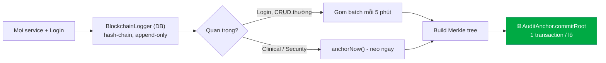

# Audit Logging & Tamper-Evidence (Hash-Chain + Merkle Anchor)

> Hệ thống ghi nhật ký (logger) chống giả mạo cho KLTN Hospital Management System.
> Tài liệu này mô tả **những gì đã làm**, **smart contract nào ghi dữ liệu gì**, **chi phí ước tính**, và **cơ chế hoạt động**.

---

## 1. Tóm tắt: bài toán và lời giải

**Yêu cầu:** mọi service đều ghi logger (kể cả lịch sử đăng nhập), nhưng **không thể** đẩy mọi log lên blockchain vì chi phí gas sẽ "trên trời".

**Lời giải — kiến trúc 3 tầng phòng thủ + 1 tầng khôi phục:**

| Trục | Cơ chế | Trả lời câu hỏi |
|---|---|---|
| Cơ bản | `SHA256(pepper + salt + data)` | "Data có khớp hash không?" |
| Chuỗi | **Hash-chain** (`seq` + `prevHash` + `entryHash`) | "Có dòng nào bị sửa/xóa/chèn không?" |
| Neo | **Merkle root** trên `AuditAnchor.sol` | "Bằng chứng có bị chính admin/insider sửa không?" |
| Khôi phục | Backup + PITR (ngoài phạm vi code này) | "Lấy lại data thế nào sau tấn công?" |

Điểm mấu chốt về chi phí: **gom log thành lô (batch), build cây Merkle, chỉ neo 1 ROOT/lô lên chain**. Gas **cố định** bất kể lô có 10 hay 10.000 log.



---

## 2. Những gì đã làm (changelog)

### Backend (NestJS)
| File | Thay đổi |
|---|---|
| `prisma/schema.prisma` | Thêm `seq`, `prevHash`, `entryHash`, `batchId` vào `BlockchainLogger`; thêm model `AuditBatch` (checkpoint Merkle). |
| `prisma/migrations/.../migration.sql` | Cột hash-chain + bảng `AuditBatch` + **trigger append-only** (cấm UPDATE nội dung / DELETE). |
| `infrastructure/audit/audit-hash.util.ts` | Thêm `computeEntryHash()` (leaf của hash-chain) + `GENESIS_PREV_HASH`. |
| `infrastructure/audit/merkle.util.ts` | **Mới** — build Merkle root, tạo & verify inclusion proof O(log n). |
| `infrastructure/audit/audit-logger.service.ts` | Ghi log có hash-chain (serialize chống race) + `verifyChain()`. |
| `infrastructure/audit/audit-anchor.service.ts` | **Mới** — cron gom batch + `commitRoot` on-chain + `anchorNow()` + `getInclusionProof()` + tự áp trigger append-only khi boot. |
| `infrastructure/audit/audit.module.ts` | Đăng ký `AuditAnchorService`, import `BlockchainModule`. |
| `infrastructure/blockchain/blockchain.service.ts` | Kết nối `AuditAnchor.sol`: `commitAuditRoot`, `getAuditRoot`, `getAuditCheckpoint`, `getLatestAuditBatchId`. |
| `modules/auth/services/auth.service.ts` | **Ghi lịch sử đăng nhập**: `LOGIN_PASSWORD`, `LOGIN_INVITE`, `LOGIN_FAIL` (sai mật khẩu / tài khoản khóa / sai credential). `writeAudit` ghi vào cả 2 store. |
| `modules/audit/` | **Mới** — `AuditController` (API admin: xem log, verify chain, list batch, lấy proof, neo thủ công). |

### Smart contract (đã có sẵn, nay được nối vào backend)
- `blockchain/contracts/AuditAnchor.sol` — append-only Merkle-root logger. **Không có** hàm update/delete.

---

## 3. Smart contract nào ghi dữ liệu gì

Hệ thống chỉ dùng các contract active bên dưới. Department/Staff/AI model không còn registry contract riêng; thay đổi của chúng đi qua `BlockchainLogger` và được neo Merkle root bằng `AuditAnchor`.

| Smart contract | Ghi dữ liệu gì on-chain | Khi nào ghi | Hàm |
|---|---|---|---|
| **`AuditAnchor.sol`** | **1 Merkle root / lô log** (`batchId`, `root`, `leafCount`, `timestamp`) | Cron 5 phút hoặc `anchorNow()` | `commitRoot()` |
| `FaceRegistry.sol` | Hash của face-template | Khi enroll khuôn mặt | `setFaceHash` |
| `IdentityRegistry.sol` | Quyền admin on-chain | Khi bind/authorize ví admin | `authorizeAdmin` |

> **`AuditAnchor` là contract trung tâm của tính năng logger này.** Các log khối lượng lớn (login, CRUD) đi qua đường Merkle batch của `AuditAnchor`.

**Dữ liệu KHÔNG BAO GIỜ lên chain:** nội dung bệnh án, PII, mật khẩu, embedding khuôn mặt, file/ảnh. Chỉ có hash 32 byte.

---

## 4. Cơ chế hoạt động

### 4.1. Ghi log (hash-chain)
Mỗi lần `AuditLoggerService.record()` được gọi (serialize để `seq` liên tục, không race):

```text
seq        = seq_trước + 1
prevHash   = entryHash của dòng trước (dòng đầu: 64 số 0)
entryHash  = SHA256( pepper | seq | prevHash | canonical(actor, action, entity, entityId, dataHash, createdAt) )
```

Vì `entryHash` phụ thuộc `prevHash`, mỗi dòng "khóa" toàn bộ lịch sử trước nó → **sửa/xóa/chèn 1 dòng là đứt chuỗi, lộ ngay** khi `verifyChain()` chạy.

### 4.2. Append-only (tầng DB)
Trigger Postgres `trg_blockchain_logger_append_only`:
- `DELETE` trên `BlockchainLogger` → **luôn bị từ chối**.
- `UPDATE` → chỉ cho phép sửa metadata neo (`onChainStatus`, `txHash`, `blockNumber`, `batchId`); mọi cột nội dung **bất biến**.

> Lưu ý: chỉ áp dụng cho **bảng log**. Bảng nghiệp vụ (`Patient`, `Department`...) vẫn `UPDATE/DELETE` bình thường.

### 4.3. Neo lên blockchain (Merkle batch)
`AuditAnchorService` (timer mỗi `AUDIT_BATCH_INTERVAL_MS`, mặc định 5 phút):
1. Lấy mọi log chưa neo (`batchId = null`), tối đa `AUDIT_BATCH_MAX_LEAVES` (mặc định 500), theo `seq`.
2. Build cây Merkle từ các `entryHash` → ra `root`.
3. Tạo `AuditBatch` trạng thái `PENDING`.
4. Gọi `AuditAnchor.commitRoot(batchId, root, leafCount)` — **1 transaction**.
5. Thành công → `AuditBatch = ANCHORED`, stamp `batchId/txHash` lên các log thành viên.
6. Thất bại → `AuditBatch = FAILED`, log ở lại hàng đợi, thử lại chu kỳ sau.

### 4.4. Verify (chứng minh toàn vẹn)
- **Off-chain:** `verifyChain()` duyệt toàn chuỗi, recompute từng `entryHash`, báo dòng đầu tiên bị lệch (nếu có).
- **On-chain:** `getInclusionProof(seq)` trả về Merkle proof O(log n); verifier độc lập recompute root từ proof + so với root bất biến trên `AuditAnchor`.

### 4.5. Phân tầng sự kiện
| Tầng | Loại | Neo |
|---|---|---|
| A | MedicalConclusion, FACE_INTEGRITY_FAIL, đổi quyền admin | **Ngay** (`anchorNow()`) |
| B | Login history, CRUD thường, đọc | Gom batch 5 phút |

---

## 5. Chi phí ước tính

`commitRoot` ghi 1 struct checkpoint (root + leafCount + timestamp + flag) + cập nhật 2 counter + emit event ≈ **~90.000–120.000 gas / lô, cố định** bất kể số log trong lô.

### Gas trên mỗi log giảm khi lô càng lớn
| Số log / lô | Số transaction | Gas / log |
|---|---|---|
| 1 (cách cũ, tệ) | 1 mỗi log | ~80.000 |
| 500 | **1** | **~200** |
| 5.000 | **1** | **~20** |

### Chi phí tiền thật (neo mỗi 5 phút ≈ 288 lô/ngày)
| Mạng | Chi phí / lô | Ghi chú |
|---|---|---|
| **Hardhat local** (đồ án này) | **0đ** | Cấu hình hiện tại. Gas miễn phí hoàn toàn. |
| Testnet (Sepolia) | **0đ** | ETH lấy từ faucet. |
| **L2** (Polygon/Base/Arbitrum) | **< 1 cent** | Khuyến nghị nếu lên production. |
| Mainnet Ethereum | ~vài USD (theo gas) | Đắt nếu neo dày; nên giãn chu kỳ (hàng giờ/ngày). |

> **Với KLTN chạy Hardhat local → chi phí thực tế = 0.** Bảng trên chứng minh thiết kế *vẫn rẻ* kể cả khi đưa lên mạng thật, vì gas cố định theo lô chứ không theo lưu lượng log.

**Tinh chỉnh chi phí qua ENV:**
- `AUDIT_BATCH_INTERVAL_MS` — chu kỳ neo (tăng = rẻ hơn nhưng "cửa sổ mềm" rộng hơn).
- `AUDIT_BATCH_MAX_LEAVES` — số log tối đa mỗi lô.
- `AUDIT_BATCH_DISABLED=true` — tắt neo (chỉ giữ hash-chain off-chain).

---

## 6. Mô hình tấn công (threat model)

| Kẻ tấn công | Phá được | KHÔNG phá được |
|---|---|---|
| Chỉ chiếm DB | — | Không có `pepper` → không giả hash; append-only chặn sửa |
| Chiếm app + `.env` | Đọc pepper | Trigger chặn sửa nội dung log tại chỗ |
| **Insider / superuser DB** | Drop trigger, sửa data + hash, đầu độc lô **tương lai** | **Không ghi đè được root đã neo** (`AuditAnchor` không có update/delete) → mọi thứ neo trước khi xâm nhập bị đóng băng, tamper bị **lộ** |

> **Giới hạn thành thật:** không hệ thống nào ngăn được kẻ có toàn quyền sửa data *sau* khi xâm nhập. Giá trị của blockchain ở đây là biến tấn công **âm thầm** thành tấn công **lộ liễu, có bằng chứng pháp lý** — và khóa cứng toàn bộ lịch sử trước thời điểm xâm nhập.

**Tăng cường (khuyến nghị production):** đưa khóa neo ra **HSM/KMS** thay vì `.env`; multisig cho `commitRoot`; app role ≠ DB owner; bên thứ 3 quan sát event `RootCommitted`.

---

## 7. API (admin, role `ADMIN`)

| Method | Endpoint | Mô tả |
|---|---|---|
| `GET` | `/audit/logs?entity=&take=` | Liệt kê log (hash-chain), mới nhất trước |
| `GET` | `/audit/verify-chain` | Verify toàn vẹn chuỗi off-chain |
| `GET` | `/audit/batches?take=` | Danh sách checkpoint Merkle đã neo |
| `GET` | `/audit/logs/:seq/proof` | Merkle inclusion proof cho 1 log, đối chiếu root on-chain |
| `POST` | `/audit/anchor-now` | Ép neo lô hiện tại ngay lập tức |

---

## 8. Triển khai

```bash
# 1. Áp schema (chọn 1)
cd backend && npx prisma migrate deploy      # production
# hoặc: npx prisma db push                    # dev (trigger tự áp khi boot)

# 2. Deploy contract (nếu chưa có) — AuditAnchor đã nằm trong deploy.js
cd blockchain && npx hardhat run scripts/deploy.js --network localhost
# Copy AUDIT_ANCHOR_ADDRESS vào .env

# 3. Đảm bảo .env có:
#   AUDIT_PEPPER=<chuỗi bí mật, KHÔNG commit>
#   AUDIT_ANCHOR_ADDRESS=<địa chỉ contract>
#   SUPER_ADMIN_PRIVATE_KEY=<relayer owner của IdentityRegistry>

# 4. Chạy backend → cron neo tự khởi động, trigger append-only tự áp.
```

**ENV liên quan:** `AUDIT_PEPPER`, `AUDIT_ANCHOR_ADDRESS`, `BLOCKCHAIN_RPC_URL`, `SUPER_ADMIN_PRIVATE_KEY`, `AUDIT_BATCH_INTERVAL_MS`, `AUDIT_BATCH_MAX_LEAVES`, `AUDIT_BATCH_DISABLED`.

---

## 9. Quét khuôn mặt cho thao tác nhạy cảm (Face Step-Up)

Một số thao tác cực kỳ nhạy cảm — **xóa bác sĩ/nhân sự**, **neo dữ liệu lên blockchain** (tốn phí, không hoàn tác) — yêu cầu **quét lại khuôn mặt ngay tại thời điểm bấm nút**, dù người dùng đã đăng nhập. Mục đích: nếu phiên bị chiếm hoặc máy bị bỏ ngỏ, kẻ khác vẫn không thể kích hoạt các thao tác mất tiền/không thể đảo ngược.

> [!NOTE]
> Đây là *step-up authentication* (xác thực bậc cao), áp dụng cho **mọi role**, không phụ thuộc role đang đăng nhập.

### Cơ chế "vé một lần" (single-use ticket)

```text
1. User bấm "Xóa bác sĩ" / "Neo blockchain"
2. Mở modal quét khuôn mặt (liveness + 128D descriptor)
3. POST /auth/face-stepup { embedding, challenge, action, resourceId }
   → match khuôn mặt + integrity gate (giống đăng nhập)
   → cấp VÉ: random 32 byte, hết hạn 3 phút, scope = (userId, action, resourceId)
   → DB chỉ lưu SHA256(vé), không lưu vé thô
4. Client gọi lại API thật kèm header  x-stepup-ticket: <vé>
5. FaceStepUpGuard tiêu vé (atomic, set usedAt) → cho phép thực thi
```

### Thuộc tính bảo mật
- **Single-use:** `consume()` dùng `updateMany ... where usedAt IS NULL` → lần thứ 2 khớp 0 dòng, không replay được.
- **Scoped:** vé cấp để xóa bác sĩ A không dùng được cho bác sĩ B, cũng không dùng cho action khác (`resourceId` bind theo `:id`/`:seq` của route).
- **Time-boxed:** hết hạn 3 phút (`STEPUP_TTL_MS`).
- **Không lưu vé thô:** chỉ lưu hash; lộ DB cũng không tái tạo được vé.
- Mọi lần step-up (pass/fail/integrity-fail) đều ghi vào audit hash-chain (`FACE_STEPUP_PASS`, `FACE_VERIFY_FAIL`...).

### Cách bật cho một endpoint mới
```ts
@UseGuards(JwtAuthGuard, RolesGuard, FaceStepUpGuard) // thêm guard ở controller
...
@Delete(':id')
@RequireFaceStepUp('DELETE_DOCTOR')   // decorator + tên action
remove(@Param('id') id: string) { ... }
```
Frontend chỉ cần mở `<FaceStepUpModal action="DELETE_DOCTOR" resourceId={id} onSuccess={ticket => service.remove(id, ticket)} />`.

### Đã áp dụng cho
| Endpoint | Action | Ghi chú |
|---|---|---|
| `DELETE /staff/:id` | `DELETE_STAFF` | Xóa/ẩn nhân sự **và bác sĩ** |
| `DELETE /departments/:id` | `DELETE_DEPARTMENT` | Xóa phòng ban |
| `POST /audit/anchor-now` | `ANCHOR_BLOCKCHAIN` | Ghi Merkle root lên chain (tốn gas) |

**ENV:** `STEPUP_TTL_MS` (mặc định 180000 = 3 phút).

**Thành phần mới:** `StepUpTicket` (schema), `StepUpService` / `FaceStepUpGuard` / `@RequireFaceStepUp` (backend), `FaceStepUpModal` (frontend), endpoint `POST /auth/face-stepup`.

---

## 10. Kiểm thử

Logic hash-chain + Merkle + proof đã được verify (chuỗi, phát hiện tamper, proof cho lô chẵn/lẻ, chống forge). Type-check `tsc --noEmit` sạch ở backend; frontend `vite build` thành công. Backend chạy trong Docker (`prisma db push` + trigger tự áp khi boot).
