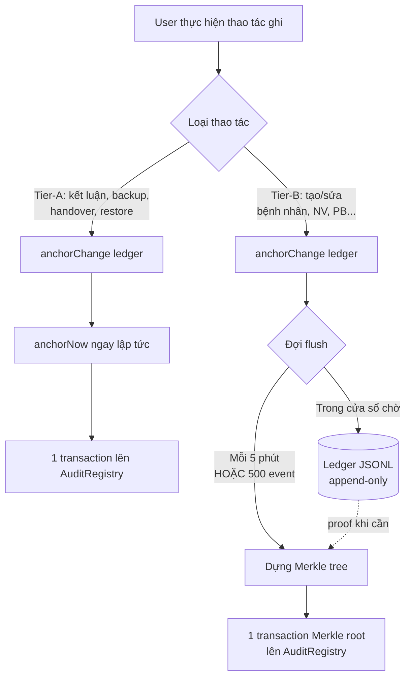

# Tier A vs Tier B & Chu kỳ neo Blockchain

Tài liệu này mô tả hai chính sách bảo mật tách biệt nhưng liên quan trong KLTN HMS:

1. **Step-up Tier A vs Tier B** — yêu cầu xác thực khuôn mặt khác nhau cho thao tác ghi.
2. **Chu kỳ neo blockchain (anchorNow vs anchorChange)** — khi nào hash đi lên on-chain ngay, khi nào gom batch.

Hai chính sách dùng cùng tên "Tier A/B" vì đi đôi với nhau, nhưng là hai trục độc lập: một trục về **xác thực người dùng**, một trục về **độ tươi của bằng chứng on-chain**.

---

## 1. Step-up: Tier A vs Tier B

### Tier A — Quét mặt mỗi lần (single-use ticket)

**Decorator backend:** `@RequireFaceStepUp('ACTION_NAME')`
**Header HTTP:** `x-stepup-ticket`
**Đặc tính ticket:**
- Dùng 1 lần (single-use)
- Sống 3 phút (`STEPUP_TTL_MS`)
- Gắn cứng vào `(userId, action, resourceId)` — không thể replay sang bản ghi khác

**Áp dụng cho:**

| Endpoint | Lý do chọn Tier A |
|---|---|
| `DELETE /departments/:id` | Xóa phòng ban: không thể đảo |
| `DELETE /staff/:id` | Vô hiệu nhân sự: ảnh hưởng quyền truy cập |
| `POST /audit/anchor-now` | Neo blockchain thủ công: ghi không thể xóa |
| `POST /backup` | Tạo bản sao toàn hệ thống |
| `POST /backup/restore` (surgical) | Khôi phục bản ghi đã bị tampered |

**Tiêu chí Tier A:** thao tác **không thể đảo ngược** HOẶC **ảnh hưởng diện rộng**. Hiếm khi xảy ra (vài lần/tháng), nên ép quét mặt mỗi lần là chấp nhận được về UX.

### Tier B — Phiên đặc quyền (sudo mode)

**Decorator backend:** `@RequireStepUpSession()`
**Header HTTP:** `x-stepup-session`
**Đặc tính phiên:**
- Mở 1 lần, dùng nhiều lần trong cửa sổ thời gian
- Idle timeout 10 phút (trượt — `STEPUP_SESSION_IDLE_MS`), tự gia hạn khi có hoạt động
- Absolute cap 30 phút (cứng — `STEPUP_SESSION_ABSOLUTE_MS`), hết là phải quét lại
- Có thể khóa thủ công sớm (nút Khóa trên header / Ngủ)

**Áp dụng cho:**

| Endpoint | Tần suất sử dụng |
|---|---|
| `POST /clinical-decisions/conclusions` | Bác sĩ đóng kết luận (mỗi bệnh nhân) |
| `POST /patients`, `PATCH /patients/:id` | Lễ tân tiếp nhận (mỗi lượt) |
| `POST /staff`, `PATCH /staff/:id`, `:id/lock`, `:id/unlock` | Admin quản lý nhân sự |
| `POST /doctors`, `POST /doctors/full`, `PATCH /doctors/:id` | Admin tạo/sửa bác sĩ |
| `POST /departments`, `PATCH /departments/:id` | Admin tạo/sửa phòng ban |
| `POST /ai-models` | Admin đăng ký model AI |
| `POST /ai-models/:id/rate` | Bác sĩ đánh giá model AI |
| `POST /paraclinical/shifts/approve` | Duyệt ca trực |
| `POST /paraclinical/shifts/assign` | Phân ca trực |

**Tiêu chí Tier B:** thao tác **lặp lại nhiều lần trong ca làm**. Quét mặt mỗi lần sẽ làm tê liệt UX. Phiên đặc quyền giải quyết được điều này mà vẫn truy vết được vì mỗi action ghi audit log riêng với `actorId` thật.

### Lớp bổ sung — Khóa màn hình tự động

> **Phạm vi:** áp dụng cho **mọi vai trò đăng nhập** (Bác sĩ, Lễ tân, Quản lý xét nghiệm, Admin, tài khoản phòng máy), không riêng bác sĩ. Đặc biệt quan trọng với các vai trò làm việc theo ca trên máy trạm dùng chung — bất kỳ ai rời máy giữa ca đều được bảo vệ như nhau.

Để giảm rủi ro "phiên Tier B đang mở mà người dùng rời máy":
- Tự khóa sau N phút không hoạt động (mặc định 5, người dùng tự chỉnh trong Hồ sơ, **hệ thống kẹp 1–15 phút**).
- Nút "Ngủ" trên header để khóa thủ công ngay.
- Mở khóa = quét mặt 1 lần (đồng thời mở luôn phiên Tier B mới — một phát ăn hai).
- Khóa = xóa phiên Tier B hiện tại để không ai có thể ghi blockchain thay.

**Cài đặt kỹ thuật (đã global sẵn):** `ScreenLockProvider` bọc toàn bộ app ở `main.jsx`; điều kiện kích hoạt chỉ là `token && user && !firstLogin` — **không lọc theo role**. Nút "Ngủ" (`SleepButton`) nằm trong `DashboardLayout` mà mọi role dùng chung, nên không cần thay đổi gì để bật cho vai trò khác.

---

## 2. Chu kỳ neo Blockchain: anchorNow vs anchorChange

Mọi entity nhạy cảm (Patient, Staff, Doctor, Department, AiModel, MedicalConclusion, ParaclinicalShift, Backup) đều ghi event vào `BlockchainLogger` rồi neo Merkle root lên contract `AuditRegistry`. Khác biệt nằm ở **khi nào** Merkle root được gửi lên chain.

### Tier-A Anchoring — `anchorNow()` (neo ngay)

Niêm phong + commit batch hiện tại lên blockchain **ngay trong cùng request**.

**Trade-off:**
- ✅ Bằng chứng on-chain có ngay, đối chiếu được tức thì
- ❌ Mỗi action = 1 transaction blockchain → phí gas + độ trễ vài giây

**Áp dụng cho:**

| Use case | Vị trí code | Lý do |
|---|---|---|
| Tạo medical conclusion | `clinical-decision/...create-medical-conclusion.use-case.ts` | Giá trị pháp lý cao, neo trễ = mất bằng chứng tức thời |
| Verify handover face B | `paraclinical-shift/...verify-handover-face-b.use-case.ts` | Bàn giao ca = chuyển trách nhiệm, phải có dấu thời gian on-chain |
| Tạo backup | `backup/...create-backup.use-case.ts` | Backup phải được seal ngay (sha256, maxSeq, prevHash) để chống sửa hậu kỳ |
| Surgical restore | `backup/...surgical-restore.use-case.ts` | Khôi phục bản ghi tampered, phải neo ngay để evidence chain liên tục |
| Anchor manual | `audit/audit.controller.ts` `anchor-now` | Admin chủ động ép neo (debug / chứng minh trực tiếp) |

### Tier-B Anchoring — `anchorChange()` (gom batch)

Append event vào AuditLog ledger; **chờ batch flush theo định kỳ hoặc theo kích thước**.

**Cơ chế (`audit-anchor.service.ts`):**
- **Theo thời gian:** mỗi `AUDIT_BATCH_INTERVAL_MS` (mặc định **5 phút**), hệ thống gom mọi event chưa neo, dựng Merkle tree, commit Merkle root lên `AuditRegistry`.
- **Theo kích thước:** nếu `AUDIT_BATCH_MAX_LEAVES` (mặc định **500**) event tích lũy trước 5 phút, neo sớm — tránh cây Merkle quá lớn.
- **Tắt được:** `AUDIT_BATCH_DISABLED=true` (chỉ dùng khi debug).

**Tại sao 5 phút, không phải neo ngay:**
- Mỗi anchor = 1 transaction blockchain (phí gas, vài giây block time).
- Ghi tạo/sửa bệnh nhân, nhân sự, phòng ban xảy ra **hàng chục lần/giờ**. Neo ngay = vài chục TX/giờ chỉ riêng cho hoạt động hành chính → không bền vững về chi phí và độ trễ.
- Gom batch 5 phút: hàng chục events → **1 Merkle root → 1 transaction**. Mỗi event vẫn có Merkle proof riêng để chứng minh nó nằm trong root đã neo.
- Cửa sổ tampering ≤ 5 phút: nếu DB bị sửa trộm trong khoảng đó, scan integrity sẽ phát hiện vì hash không khớp với leaf đã ghi vào ledger (ledger là append-only JSONL trên ổ đĩa).

**Áp dụng cho:**

| Entity | Adapter | Use case ví dụ |
|---|---|---|
| Patient | `audit-patient-integrity.anchor.ts` | create, update |
| Staff | `blockchain-staff-integrity.anchor.ts` | create, update, lock, unlock, soft-delete |
| Doctor | `blockchain-doctor-integrity.anchor.ts` | create, update |
| Department | `blockchain-department-integrity.anchor.ts` | create, update, soft-delete |
| AiModel | `blockchain-ai-model-integrity.anchor.ts` | create, rate |
| ParaclinicalShift | shift adapter | approve, assign |

### Sơ đồ tổng quan

### Daily backup cron — System-initiated

Một flow đặc biệt: backup tự động mỗi 02:00 sáng (`backup-scheduler.service.ts`).
- **Không yêu cầu step-up** (không có user thao tác → không có ai để xác thực).
- Backup **luôn `anchorNow()`** — Tier-A anchoring dù là cron, vì backup phải seal kết quả immutable ngay.
- Bật/tắt qua `BACKUP_CRON_ENABLED`, đổi giờ qua `BACKUP_CRON_HOUR`.

---

## 3. Bảng tham chiếu nhanh

| Trục | Quy tắc |
|---|---|
| **Step-up Tier A** (quét mặt mỗi lần) | Thao tác phá hủy / không thể đảo / hiếm |
| **Step-up Tier B** (phiên đặc quyền) | Thao tác lặp lại nhiều lần trong ca |
| **Anchor `anchorNow()`** (neo ngay) | Bằng chứng phải có trên chain ngay (kết luận, backup, bàn giao) |
| **Anchor `anchorChange()` + batch 5'** | Hành chính hàng loạt — tiết kiệm gas, vẫn truy vết được |

> **Lưu ý quan trọng:** Step-up Tier và Anchor Tier KHÔNG luôn trùng nhau. Ví dụ:
> - Kết luận bệnh án: Step-up **Tier B** (bác sĩ đóng nhiều ca) + Anchor **Tier-A immediate** (giá trị pháp lý cao).
> - Tạo bệnh nhân: Step-up **Tier B** + Anchor **Tier-B batch** (cả hai trục đều "thường ngày").
> - Xóa phòng ban: Step-up **Tier A** + Anchor **Tier-B batch** (xóa hiếm, nhưng không cần neo ngay vì anchor batch tiếp theo trong 5' là đủ — proof vẫn không tampered được).

---

## 4. Biến môi trường liên quan

| Biến | Mặc định | Tác dụng |
|---|---|---|
| `STEPUP_TTL_MS` | 180000 (3 phút) | TTL ticket Tier A |
| `STEPUP_SESSION_IDLE_MS` | 600000 (10 phút) | Idle window phiên Tier B |
| `STEPUP_SESSION_ABSOLUTE_MS` | 1800000 (30 phút) | Trần cứng phiên Tier B |
| `AUDIT_BATCH_INTERVAL_MS` | 300000 (5 phút) | Chu kỳ flush batch anchor |
| `AUDIT_BATCH_MAX_LEAVES` | 500 | Ép neo sớm khi đầy lá |
| `AUDIT_BATCH_DISABLED` | `false` | Tắt batch anchor (debug only) |
| `BACKUP_CRON_ENABLED` | `true` | Bật cron backup hằng ngày |
| `BACKUP_CRON_HOUR` | `2` | Giờ chạy backup (0–23) |
